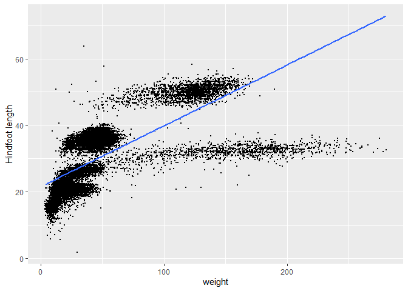
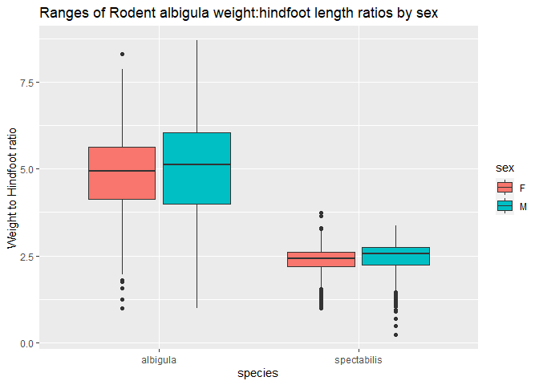

## Instructions
Answer the following questions and complete the exercises in RMarkdown. Please embed all of your code and push your final work to your repository. Your final lab report should be organized, clean, and run free from errors. Remember, you must remove the `#` for the included code chunks to run. Be sure to add your name to the author header above. For any included plots, make sure they are clearly labeled. You are free to use any plot type that you feel best communicates the results of your analysis.  

Make sure to use the formatting conventions of RMarkdown to make your report neat and clean!  

## Load the libraries

```r
library(tidyverse)
library(janitor)
library(here)
library(naniar)
```

## Desert Ecology
For this assignment, we are going to use a modified data set on [desert ecology](http://esapubs.org/archive/ecol/E090/118/). The data are from: S. K. Morgan Ernest, Thomas J. Valone, and James H. Brown. 2009. Long-term monitoring and experimental manipulation of a Chihuahuan Desert ecosystem near Portal, Arizona, USA. Ecology 90:1708.

```r
deserts <- read_csv(here("lab10", "data", "surveys_complete.csv")) %>% clean_names
```

```
## Rows: 34786 Columns: 13
```

```
## -- Column specification --------------------------------------------------------
## Delimiter: ","
## chr (6): species_id, sex, genus, species, taxa, plot_type
## dbl (7): record_id, month, day, year, plot_id, hindfoot_length, weight
```

```
## 
## i Use `spec()` to retrieve the full column specification for this data.
## i Specify the column types or set `show_col_types = FALSE` to quiet this message.
```

1. Use the function(s) of your choice to get an idea of its structure, including how NA's are treated. Are the data tidy?  

```r
skimr::skim(deserts)
```


Table: Data summary

|                         |        |
|:------------------------|:-------|
|Name                     |deserts |
|Number of rows           |34786   |
|Number of columns        |13      |
|_______________________  |        |
|Column type frequency:   |        |
|character                |6       |
|numeric                  |7       |
|________________________ |        |
|Group variables          |None    |


**Variable type: character**

|skim_variable | n_missing| complete_rate| min| max| empty| n_unique| whitespace|
|:-------------|---------:|-------------:|---:|---:|-----:|--------:|----------:|
|species_id    |         0|          1.00|   2|   2|     0|       48|          0|
|sex           |      1748|          0.95|   1|   1|     0|        2|          0|
|genus         |         0|          1.00|   6|  16|     0|       26|          0|
|species       |         0|          1.00|   3|  15|     0|       40|          0|
|taxa          |         0|          1.00|   4|   7|     0|        4|          0|
|plot_type     |         0|          1.00|   7|  25|     0|        5|          0|


**Variable type: numeric**

|skim_variable   | n_missing| complete_rate|     mean|       sd|   p0|     p25|     p50|      p75|  p100|hist                                     |
|:---------------|---------:|-------------:|--------:|--------:|----:|-------:|-------:|--------:|-----:|:----------------------------------------|
|record_id       |         0|          1.00| 17804.20| 10229.68|    1| 8964.25| 17761.5| 26654.75| 35548|▇▇▇▇▇ |
|month           |         0|          1.00|     6.47|     3.40|    1|    4.00|     6.0|    10.00|    12|▇▆▆▅▇ |
|day             |         0|          1.00|    16.10|     8.25|    1|    9.00|    16.0|    23.00|    31|▆▇▇▇▆ |
|year            |         0|          1.00|  1990.50|     7.47| 1977| 1984.00|  1990.0|  1997.00|  2002|▇▆▇▇▇ |
|plot_id         |         0|          1.00|    11.34|     6.79|    1|    5.00|    11.0|    17.00|    24|▇▆▇▆▅ |
|hindfoot_length |      3348|          0.90|    29.29|     9.56|    2|   21.00|    32.0|    36.00|    70|▁▇▇▁▁ |
|weight          |      2503|          0.93|    42.67|    36.63|    4|   20.00|    37.0|    48.00|   280|▇▁▁▁▁ |

```r
miss_var_summary(deserts)
```

```
## # A tibble: 13 x 3
##    variable        n_miss pct_miss
##    <chr>            <int>    <dbl>
##  1 hindfoot_length   3348     9.62
##  2 weight            2503     7.20
##  3 sex               1748     5.03
##  4 record_id            0     0   
##  5 month                0     0   
##  6 day                  0     0   
##  7 year                 0     0   
##  8 plot_id              0     0   
##  9 species_id           0     0   
## 10 genus                0     0   
## 11 species              0     0   
## 12 taxa                 0     0   
## 13 plot_type            0     0
```

*The data appears tidy, as each variable has its own column, each observation their own row, and each value has its own cell.*

```r
deserts
```

```
## # A tibble: 34,786 x 13
##    record_id month   day  year plot_id species_id sex   hindfoot_length weight
##        <dbl> <dbl> <dbl> <dbl>   <dbl> <chr>      <chr>           <dbl>  <dbl>
##  1         1     7    16  1977       2 NL         M                  32     NA
##  2         2     7    16  1977       3 NL         M                  33     NA
##  3         3     7    16  1977       2 DM         F                  37     NA
##  4         4     7    16  1977       7 DM         M                  36     NA
##  5         5     7    16  1977       3 DM         M                  35     NA
##  6         6     7    16  1977       1 PF         M                  14     NA
##  7         7     7    16  1977       2 PE         F                  NA     NA
##  8         8     7    16  1977       1 DM         M                  37     NA
##  9         9     7    16  1977       1 DM         F                  34     NA
## 10        10     7    16  1977       6 PF         F                  20     NA
## # ... with 34,776 more rows, and 4 more variables: genus <chr>, species <chr>,
## #   taxa <chr>, plot_type <chr>
```

2. How many genera and species are represented in the data? What are the total number of observations? Which species is most/ least frequently sampled in the study?

*Dipodomys was the most represented genus in the data.*

```r
deserts %>%
  count(genus) %>%
  arrange(desc(n))
```

```
## # A tibble: 26 x 2
##    genus                n
##    <chr>            <int>
##  1 Dipodomys        16167
##  2 Chaetodipus       6029
##  3 Onychomys         3267
##  4 Reithrodontomys   2694
##  5 Peromyscus        2234
##  6 Perognathus       1629
##  7 Neotoma           1252
##  8 Ammospermophilus   437
##  9 Amphispiza         303
## 10 Spermophilus       249
## # ... with 16 more rows
```

*Dipodomys merriami appears the most in this study, which is commonly known as Merriam's kangaroo rat.*

```r
deserts %>%
  count(genus,species) %>%
  arrange(desc(n))
```

```
## # A tibble: 48 x 3
##    genus           species          n
##    <chr>           <chr>        <int>
##  1 Dipodomys       merriami     10596
##  2 Chaetodipus     penicillatus  3123
##  3 Dipodomys       ordii         3027
##  4 Chaetodipus     baileyi       2891
##  5 Reithrodontomys megalotis     2609
##  6 Dipodomys       spectabilis   2504
##  7 Onychomys       torridus      2249
##  8 Perognathus     flavus        1597
##  9 Peromyscus      eremicus      1299
## 10 Neotoma         albigula      1252
## # ... with 38 more rows
```

*The most and least frequently sampled species listed below:*

```r
deserts %>%
  count(genus,species) %>%
  filter(n==max(n)|n==min(n)) %>%
  arrange(desc(n))
```

```
## # A tibble: 7 x 3
##   genus         species          n
##   <chr>         <chr>        <int>
## 1 Dipodomys     merriami     10596
## 2 Cnemidophorus tigris           1
## 3 Cnemidophorus uniparens        1
## 4 Crotalus      scutalatus       1
## 5 Crotalus      viridis          1
## 6 Sceloporus    clarki           1
## 7 Spermophilus  tereticaudus     1
```

3. What is the proportion of taxa included in this study? Show a table and plot that reflects this count.

*From the table, we see that the rodent taxon takes up 98.45% of all taxa taken down in this study.*

```r
deserts_proportions <- deserts %>%
  count(taxa) %>%
  mutate(percent_of_observations = (n/34786)*100)
deserts_proportions
```

```
## # A tibble: 4 x 3
##   taxa        n percent_of_observations
##   <chr>   <int>                   <dbl>
## 1 Bird      450                  1.29  
## 2 Rabbit     75                  0.216 
## 3 Reptile    14                  0.0402
## 4 Rodent  34247                 98.5
```


```r
ggplot(data=deserts_proportions, aes(x=taxa, y=percent_of_observations)) +geom_col(color="black") + labs(x="Taxa", y="% of Observations", title="Percentage of taxa in study")
```

<!-- -->

*Observing the count of taxa thru a log10 y scale.*

```r
deserts %>%
  count(taxa) %>%
  ggplot(aes(x=taxa, y=n)) +geom_col(color="black") +scale_y_log10() +labs(y="# of observations (log10)", x="Taxa", title="Proportion of taxa (log10 of observations") 
```

<!-- -->

4. For the taxa included in the study, use the fill option to show the proportion of individuals sampled by `plot_type.`


```r
deserts %>% 
		ggplot(aes(x = taxa, fill = plot_type))+
		geom_bar(position = position_fill())+ scale_y_continuous(labels = scales::percent)+coord_flip()
```

<!-- -->

5. What is the range of weight for each species included in the study? Remove any observations of weight that are NA so they do not show up in the plot.


```r
deserts %>%
  filter(!is.na(weight)) %>%
  ggplot(aes(x=species, y=weight))+geom_boxplot() +coord_flip()
```

<!-- -->

6. Add another layer to your answer from #4 using `geom_point` to get an idea of how many measurements were taken for each species.


```r
deserts %>%
  filter(!is.na(weight)) %>%
  ggplot(aes(x=species, y=weight))+geom_point() +coord_flip()
```

<!-- -->

7. [Dipodomys merriami](https://en.wikipedia.org/wiki/Merriam's_kangaroo_rat) is the most frequently sampled animal in the study. How have the number of observations of this species changed over the years included in the study?


```r
deserts %>%
  filter(species=="merriami") %>%
  count(year) %>%
  ggplot(aes(x=year, y=n))+geom_col() +labs(y="# of observations", x="Year", title="Record of Dipodomys merriami throughout the years")
```

<!-- -->

8. What is the relationship between `weight` and `hindfoot` length? Consider whether or not over plotting is an issue.

*The line of best fit shows us a positive correlation between weight and hindfoot length, but the data is very condensed in certain regions.*

```r
deserts %>%
  filter(!is.na(weight)&!is.na(hindfoot_length)) %>%
  ggplot(aes(x=weight, y=hindfoot_length)) +geom_jitter(size=0.4) +geom_smooth(method=lm, se=F) +labs(y="Hindfoot length")
```

```
## `geom_smooth()` using formula 'y ~ x'
```

<!-- -->

9. Which two species have, on average, the highest weight? Once you have identified them, make a new column that is a ratio of `weight` to `hindfoot_length`. Make a plot that shows the range of this new ratio and fill by sex.

*Rodent albigula has the highest average weight.*

```r
deserts %>%
  group_by(taxa,species) %>%
  summarize(avg_weight=mean(weight, na.rm=T)) %>%
  arrange(desc(avg_weight))
```

```
## `summarise()` has grouped output by 'taxa'. You can override using the `.groups` argument.
```

```
## # A tibble: 42 x 3
## # Groups:   taxa [4]
##    taxa   species      avg_weight
##    <chr>  <chr>             <dbl>
##  1 Rodent albigula          159. 
##  2 Rodent spectabilis       120. 
##  3 Rodent spilosoma          93.5
##  4 Rodent hispidus           65.6
##  5 Rodent fulviventer        58.9
##  6 Rodent ochrognathus       55.4
##  7 Rodent ordii              48.9
##  8 Rodent merriami           43.2
##  9 Rodent baileyi            31.7
## 10 Rodent leucogaster        31.6
## # ... with 32 more rows
```


```r
deserts %>%
  filter(species=="albigula" & !is.na(weight) & !is.na(hindfoot_length)) %>%
  mutate(weight_to_hindfoot_ratio=weight/hindfoot_length) %>%
  ggplot(aes(x=species, y=weight_to_hindfoot_ratio, fill=sex)) +geom_boxplot() +labs(title="Ranges of Rodent albigula weight:hindfoot length ratios by sex", y="Weight to Hindfoot ratio")
```

<!-- -->

10. Make one plot of your choice! Make sure to include at least two of the aesthetics options you have learned.

*I will compare the weights of rodents for the months of January through June and fill by plot_type.*


```r
deserts %>%
  filter(taxa=="Rodent") %>%
  ggplot(aes(x=month, y=weight, fill=plot_type)) +geom_col(position="dodge") +xlim(0,6.75) +labs(title="Rodent weights compared by month and plot type")
```

```
## Warning: Removed 17984 rows containing missing values (geom_col).
```

<!-- -->


## Push your final code to GitHub!
Please be sure that you check the `keep md` file in the knit preferences. 
