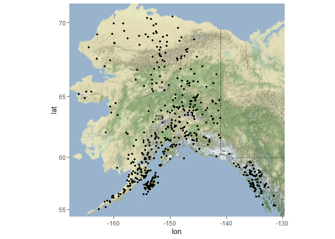
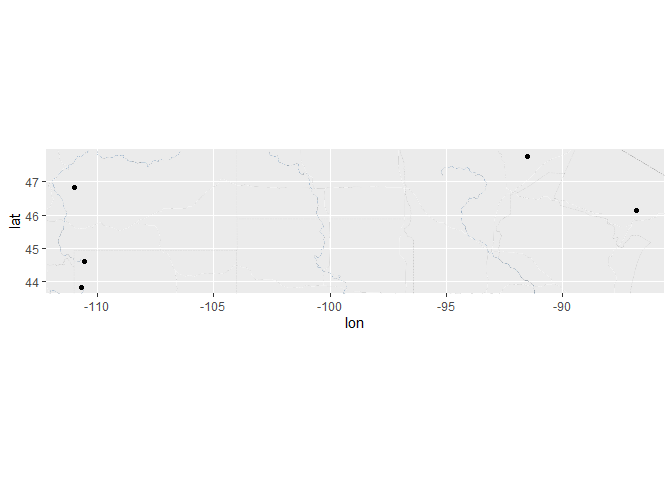
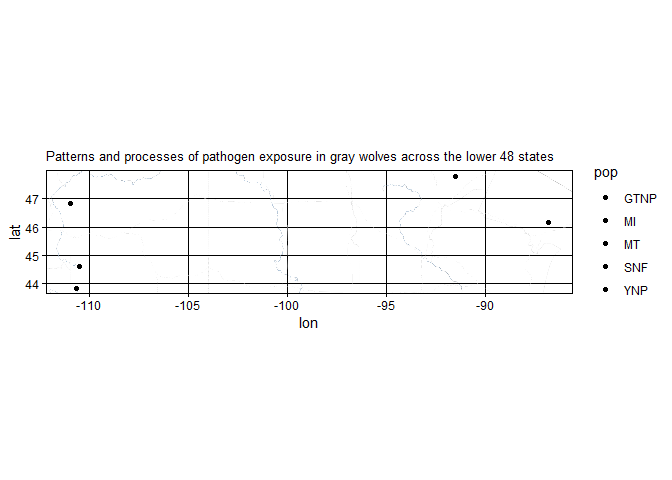

## Instructions
Answer the following questions and complete the exercises in RMarkdown. Please embed all of your code and push your final work to your repository. Your final lab report should be organized, clean, and run free from errors. Remember, you must remove the `#` for the included code chunks to run. Be sure to add your name to the author header above. For any included plots, make sure they are clearly labeled. You are free to use any plot type that you feel best communicates the results of your analysis.  

Make sure to use the formatting conventions of RMarkdown to make your report neat and clean!  

## Load the libraries

```r
library(tidyverse)
library(janitor)
library(here)
library(ggmap)
library(ggthemes)
```

## Load the Data
We will use two separate data sets for this homework.  

1. The first [data set](https://rcweb.dartmouth.edu/~f002d69/workshops/index_rspatial.html) represent sightings of grizzly bears (Ursos arctos) in Alaska.  
2. The second data set is from Brandell, Ellen E (2021), Serological dataset and R code for: Patterns and processes of pathogen exposure in gray wolves across North America, Dryad, [Dataset](https://doi.org/10.5061/dryad.5hqbzkh51).  

1. Load the `grizzly` data and evaluate its structure. As part of this step, produce a summary that provides the range of latitude and longitude so you can build an appropriate bounding box.


```r
grizzly <- read_csv(here("lab12", "data", "bear-sightings.csv")) %>% clean_names()
```

```
## Rows: 494 Columns: 3
## -- Column specification --------------------------------------------------------
## Delimiter: ","
## dbl (3): bear.id, longitude, latitude
## 
## i Use `spec()` to retrieve the full column specification for this data.
## i Specify the column types or set `show_col_types = FALSE` to quiet this message.
```

```r
summary(grizzly)
```

```
##     bear_id       longitude         latitude    
##  Min.   :   7   Min.   :-166.2   Min.   :55.02  
##  1st Qu.:2569   1st Qu.:-154.2   1st Qu.:58.13  
##  Median :4822   Median :-151.0   Median :60.97  
##  Mean   :4935   Mean   :-149.1   Mean   :61.41  
##  3rd Qu.:7387   3rd Qu.:-145.6   3rd Qu.:64.13  
##  Max.   :9996   Max.   :-131.3   Max.   :70.37
```

2. Use the range of the latitude and longitude to build an appropriate bounding box for your map.


```r
long <- c(-166.2, -131.3)
lat <- c(55.02, 70.37)
bbox <- make_bbox(long, lat, f=0.05)
```

3. Load a map from `stamen` in a terrain style projection and display the map.


```r
map1 <- get_map(bbox, maptype = "terrain", source="stamen")
```

```
## Map tiles by Stamen Design, under CC BY 3.0. Data by OpenStreetMap, under ODbL.
```

4. Build a final map that overlays the recorded observations of grizzly bears in Alaska.


```r
ggmap(map1) + geom_point(data=grizzly, aes(longitude, latitude), size=1)
```

<!-- -->

Let's switch to the wolves data. Brandell, Ellen E (2021), Serological dataset and R code for: Patterns and processes of pathogen exposure in gray wolves across North America, Dryad, [Dataset](https://doi.org/10.5061/dryad.5hqbzkh51).  

5. Load the data and evaluate its structure.  


```r
wolves <- read_csv(here("lab12", "data", "wolves_data", "wolves_dataset.csv")) %>% clean_names
```

```
## Rows: 1986 Columns: 23
## -- Column specification --------------------------------------------------------
## Delimiter: ","
## chr  (4): pop, age.cat, sex, color
## dbl (19): year, lat, long, habitat, human, pop.density, pack.size, standard....
## 
## i Use `spec()` to retrieve the full column specification for this data.
## i Specify the column types or set `show_col_types = FALSE` to quiet this message.
```

6. How many distinct wolf populations are included in this study? Make a new object that restricts the data to the wolf populations in the lower 48 US states.


```r
wolves %>%
  group_by(pop) %>%
  count()
```

```
## # A tibble: 17 x 2
## # Groups:   pop [17]
##    pop         n
##    <chr>   <int>
##  1 AK.PEN    100
##  2 BAN.JAS    96
##  3 BC        145
##  4 DENALI    154
##  5 ELLES      11
##  6 GTNP       60
##  7 INT.AK     35
##  8 MEXICAN   181
##  9 MI        102
## 10 MT        351
## 11 N.NWT      67
## 12 ONT        60
## 13 SE.AK      10
## 14 SNF        92
## 15 SS.NWT     34
## 16 YNP       383
## 17 YUCH      105
```


```r
wolves %>%
  filter(pop=="BAN.JAS")
```

```
## # A tibble: 96 x 23
##    pop      year age_cat sex   color   lat  long habitat human pop_density
##    <chr>   <dbl> <chr>   <chr> <chr> <dbl> <dbl>   <dbl> <dbl>       <dbl>
##  1 BAN.JAS  2001 A       F     B      52.2 -117.  18553. 1145.        8.85
##  2 BAN.JAS  2003 A       F     B      52.2 -117.  18553. 1145.        8.85
##  3 BAN.JAS  2001 A       F     B      52.2 -117.  18553. 1145.        8.85
##  4 BAN.JAS  2003 A       F     B      52.2 -117.  18553. 1145.        8.85
##  5 BAN.JAS  2005 S       M     B      52.2 -117.  18553. 1145.        8.85
##  6 BAN.JAS  2001 A       F     G      52.2 -117.  18553. 1145.        8.85
##  7 BAN.JAS  2001 S       F     G      52.2 -117.  18553. 1145.        8.85
##  8 BAN.JAS  2006 A       F     <NA>   52.2 -117.  18553. 1145.        8.85
##  9 BAN.JAS  2001 A       M     G      52.2 -117.  18553. 1145.        8.85
## 10 BAN.JAS  2003 A       M     G      52.2 -117.  18553. 1145.        8.85
## # ... with 86 more rows, and 13 more variables: pack_size <dbl>,
## #   standard_habitat <dbl>, standard_human <dbl>, standard_pop <dbl>,
## #   standard_packsize <dbl>, standard_latitude <dbl>, standard_longitude <dbl>,
## #   cav_binary <dbl>, cdv_binary <dbl>, cpv_binary <dbl>, chv_binary <dbl>,
## #   neo_binary <dbl>, toxo_binary <dbl>
```


```r
wolves_48 <- wolves %>%
  filter(lat<=49.5 & !pop=="MEXICAN")
wolves_48
```

```
## # A tibble: 988 x 23
##    pop    year age_cat sex   color   lat  long habitat human pop_density
##    <chr> <dbl> <chr>   <chr> <chr> <dbl> <dbl>   <dbl> <dbl>       <dbl>
##  1 GTNP   2012 P       M     G      43.8 -111.  10375. 3924.        34.0
##  2 GTNP   2012 P       F     G      43.8 -111.  10375. 3924.        34.0
##  3 GTNP   2012 P       F     G      43.8 -111.  10375. 3924.        34.0
##  4 GTNP   2012 P       M     B      43.8 -111.  10375. 3924.        34.0
##  5 GTNP   2013 A       F     G      43.8 -111.  10375. 3924.        34.0
##  6 GTNP   2013 A       M     G      43.8 -111.  10375. 3924.        34.0
##  7 GTNP   2013 P       M     G      43.8 -111.  10375. 3924.        34.0
##  8 GTNP   2013 P       M     G      43.8 -111.  10375. 3924.        34.0
##  9 GTNP   2013 P       M     G      43.8 -111.  10375. 3924.        34.0
## 10 GTNP   2013 P       F     G      43.8 -111.  10375. 3924.        34.0
## # ... with 978 more rows, and 13 more variables: pack_size <dbl>,
## #   standard_habitat <dbl>, standard_human <dbl>, standard_pop <dbl>,
## #   standard_packsize <dbl>, standard_latitude <dbl>, standard_longitude <dbl>,
## #   cav_binary <dbl>, cdv_binary <dbl>, cpv_binary <dbl>, chv_binary <dbl>,
## #   neo_binary <dbl>, toxo_binary <dbl>
```

7. Use the range of the latitude and longitude to build an appropriate bounding box for your map.


```r
summary(wolves_48)
```

```
##      pop                 year        age_cat              sex           
##  Length:988         Min.   :1997   Length:988         Length:988        
##  Class :character   1st Qu.:2006   Class :character   Class :character  
##  Mode  :character   Median :2010   Mode  :character   Mode  :character  
##                     Mean   :2010                                        
##                     3rd Qu.:2014                                        
##                     Max.   :2019                                        
##                                                                         
##     color                lat             long            habitat     
##  Length:988         Min.   :43.82   Min.   :-110.99   Min.   : 9511  
##  Class :character   1st Qu.:44.60   1st Qu.:-110.99   1st Qu.:11166  
##  Mode  :character   Median :46.15   Median :-110.55   Median :11166  
##                     Mean   :45.80   Mean   :-106.49   Mean   :12906  
##                     3rd Qu.:46.83   3rd Qu.:-110.55   3rd Qu.:11211  
##                     Max.   :47.75   Max.   : -86.82   Max.   :32018  
##                                                                      
##      human       pop_density      pack_size    standard_habitat  
##  Min.   :3240   Min.   :11.63   Min.   :4.81   Min.   :-0.41960  
##  1st Qu.:3240   1st Qu.:11.63   1st Qu.:5.62   1st Qu.:-0.20240  
##  Median :3973   Median :25.32   Median :7.12   Median :-0.20240  
##  Mean   :3997   Mean   :22.14   Mean   :6.87   Mean   : 0.02588  
##  3rd Qu.:3973   3rd Qu.:28.93   3rd Qu.:8.25   3rd Qu.:-0.19650  
##  Max.   :6229   Max.   :33.96   Max.   :8.25   Max.   : 2.53310  
##                                                                  
##  standard_human    standard_pop     standard_packsize standard_latitude
##  Min.   :0.5834   Min.   :-0.2976   Min.   :-1.0179   Min.   :-0.7219  
##  1st Qu.:0.5834   1st Qu.:-0.2976   1st Qu.:-0.5418   1st Qu.:-0.6369  
##  Median :0.9383   Median : 1.1548   Median : 0.3399   Median :-0.4677  
##  Mean   :0.9497   Mean   : 0.8179   Mean   : 0.1927   Mean   :-0.5058  
##  3rd Qu.:0.9383   3rd Qu.: 1.5378   3rd Qu.: 1.0041   3rd Qu.:-0.3926  
##  Max.   :2.0290   Max.   : 2.0715   Max.   : 1.0041   Max.   :-0.2927  
##                                                                        
##  standard_longitude   cav_binary       cdv_binary       cpv_binary    
##  Min.   :0.3069     Min.   :0.0000   Min.   :0.0000   Min.   :0.0000  
##  1st Qu.:0.3069     1st Qu.:1.0000   1st Qu.:0.0000   1st Qu.:1.0000  
##  Median :0.3302     Median :1.0000   Median :0.0000   Median :1.0000  
##  Mean   :0.5424     Mean   :0.8342   Mean   :0.2769   Mean   :0.8852  
##  3rd Qu.:0.3302     3rd Qu.:1.0000   3rd Qu.:1.0000   3rd Qu.:1.0000  
##  Max.   :1.5716     Max.   :1.0000   Max.   :1.0000   Max.   :1.0000  
##                     NA's   :41       NA's   :2        NA's   :4       
##    chv_binary       neo_binary      toxo_binary    
##  Min.   :0.0000   Min.   :0.0000   Min.   :0.0000  
##  1st Qu.:1.0000   1st Qu.:0.0000   1st Qu.:0.0000  
##  Median :1.0000   Median :0.0000   Median :0.0000  
##  Mean   :0.7903   Mean   :0.3777   Mean   :0.4817  
##  3rd Qu.:1.0000   3rd Qu.:1.0000   3rd Qu.:1.0000  
##  Max.   :1.0000   Max.   :1.0000   Max.   :1.0000  
##  NA's   :201      NA's   :207      NA's   :496
```


```r
long <- c(-110.99, -86.82)
lat <- c(43.82, 47.75)
bbox_wolf <- make_bbox(long, lat, f=0.05)
```

8.  Load a map from `stamen` in a `terrain-lines` projection and display the map.


```r
mapwolf <- get_map(bbox_wolf, maptype="terrain-lines", source="stamen")
```

```
## Map tiles by Stamen Design, under CC BY 3.0. Data by OpenStreetMap, under ODbL.
```

9. Build a final map that overlays the recorded observations of wolves in the lower 48 states.


```r
ggmap(mapwolf) +geom_point(data=wolves_48, aes(long,lat))
```

<!-- -->

10. Use the map from #9 above, but add some aesthetics. Try to `fill` and `color` by population.


```r
ggmap(mapwolf) +geom_point(data=wolves_48, aes(long,lat, fill=pop)) +labs(title = "Patterns and processes of pathogen exposure in gray wolves across the lower 48 states")  +theme_linedraw() +theme(plot.title=element_text(size=10))
```

<!-- -->

## Push your final code to GitHub!
Please be sure that you check the `keep md` file in the knit preferences. 
