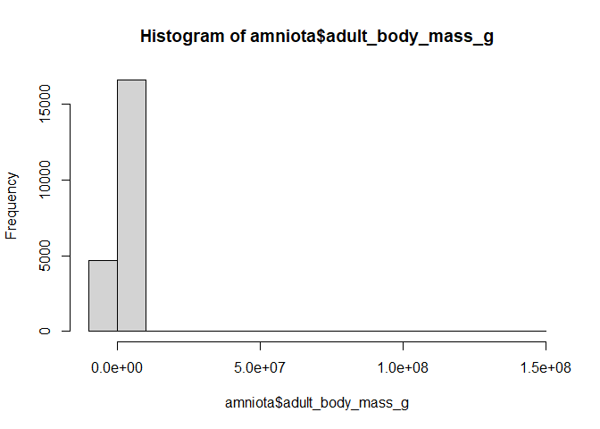

## Learning Goals
*At the end of this exercise, you will be able to:*    
1. Define `NA` and describe how they are treated in R.  
2. Produce summaries of the number of NA's in a data set.   
3. Replace values with `NA` in a data set as appropriate.  

## Install the packages `naniar` and `visdat`
We will use these in part 2 of today's lab.

```r
#install.packages("naniar")
#install.packages("visdat")
```

## Load the libraries

```r
library("tidyverse")
```

```
## -- Attaching packages --------------------------------------- tidyverse 1.3.1 --
```

```
## v ggplot2 3.3.5     v purrr   0.3.4
## v tibble  3.1.6     v dplyr   1.0.7
## v tidyr   1.1.4     v stringr 1.4.0
## v readr   2.1.1     v forcats 0.5.1
```

```
## -- Conflicts ------------------------------------------ tidyverse_conflicts() --
## x dplyr::filter() masks stats::filter()
## x dplyr::lag()    masks stats::lag()
```

```r
library("dplyr")
library("naniar")
library("skimr")
```

```
## 
## Attaching package: 'skimr'
```

```
## The following object is masked from 'package:naniar':
## 
##     n_complete
```

```r
library("janitor")
```

```
## 
## Attaching package: 'janitor'
```

```
## The following objects are masked from 'package:stats':
## 
##     chisq.test, fisher.test
```

## Dealing with NA's
In almost all large data sets, there are missing observations. These can be tricky to deal with, partly because you first need to determine how missing values were treated in the original study. In a given data set, NA might represent values that are unrecorded because they are unknown or missing. But, they can also represent data that are not applicable.  

Scientists use different conventions in showing missing data; some use blank spaces, others use "-", etc. Unfortunately, sometimes **missing data is indicated with numbers like -999.0 or zero!**, though this can be required in some situations (for example raster data). Often, a combination of methods are used. It is up to the data analyst to find out how missing values are represented in the data set and to deal with them appropriately. Remember, if missing data are represented by values then R will treat them as such and you could be misled.  

## For the following examples, we will use the built-in `msleep` data

```r
?msleep
```

```
## starting httpd help server ... done
```

## Are there any NA's?  
The `summary()` function in base R will tally NA's by variable, but only for categorical/factor, numeric, integer, or logical columns. What about any NA values in the character columns?

```r
summary(msleep)
```

```
##      name              genus               vore              order          
##  Length:83          Length:83          Length:83          Length:83         
##  Class :character   Class :character   Class :character   Class :character  
##  Mode  :character   Mode  :character   Mode  :character   Mode  :character  
##                                                                             
##                                                                             
##                                                                             
##                                                                             
##  conservation        sleep_total      sleep_rem      sleep_cycle    
##  Length:83          Min.   : 1.90   Min.   :0.100   Min.   :0.1167  
##  Class :character   1st Qu.: 7.85   1st Qu.:0.900   1st Qu.:0.1833  
##  Mode  :character   Median :10.10   Median :1.500   Median :0.3333  
##                     Mean   :10.43   Mean   :1.875   Mean   :0.4396  
##                     3rd Qu.:13.75   3rd Qu.:2.400   3rd Qu.:0.5792  
##                     Max.   :19.90   Max.   :6.600   Max.   :1.5000  
##                                     NA's   :22      NA's   :51      
##      awake          brainwt            bodywt        
##  Min.   : 4.10   Min.   :0.00014   Min.   :   0.005  
##  1st Qu.:10.25   1st Qu.:0.00290   1st Qu.:   0.174  
##  Median :13.90   Median :0.01240   Median :   1.670  
##  Mean   :13.57   Mean   :0.28158   Mean   : 166.136  
##  3rd Qu.:16.15   3rd Qu.:0.12550   3rd Qu.:  41.750  
##  Max.   :22.10   Max.   :5.71200   Max.   :6654.000  
##                  NA's   :27
```

Let's next check to see if our data has any NA's by evaluating everything logically. We have done this before, but this is a good time to review. `is.na()` is a function that determines whether a value in a data frame is or is not an NA. This is evaluated as TRUE or FALSE. This means that R is looking in the data for NA, not for any values that might represent NA. To R, an NA is an empty cell or spot in a vector.  

Keep in mind, if the authors of the data represented NA's in another way, they will not be detected by R.  

```r
is.na(msleep)
```

```
##        name genus  vore order conservation sleep_total sleep_rem sleep_cycle
##  [1,] FALSE FALSE FALSE FALSE        FALSE       FALSE      TRUE        TRUE
##  [2,] FALSE FALSE FALSE FALSE         TRUE       FALSE     FALSE        TRUE
##  [3,] FALSE FALSE FALSE FALSE        FALSE       FALSE     FALSE        TRUE
##  [4,] FALSE FALSE FALSE FALSE        FALSE       FALSE     FALSE       FALSE
##  [5,] FALSE FALSE FALSE FALSE        FALSE       FALSE     FALSE       FALSE
##  [6,] FALSE FALSE FALSE FALSE         TRUE       FALSE     FALSE       FALSE
##  [7,] FALSE FALSE FALSE FALSE        FALSE       FALSE     FALSE       FALSE
##  [8,] FALSE FALSE  TRUE FALSE         TRUE       FALSE      TRUE        TRUE
##  [9,] FALSE FALSE FALSE FALSE        FALSE       FALSE     FALSE       FALSE
## [10,] FALSE FALSE FALSE FALSE        FALSE       FALSE      TRUE        TRUE
## [11,] FALSE FALSE FALSE FALSE        FALSE       FALSE     FALSE        TRUE
## [12,] FALSE FALSE FALSE FALSE        FALSE       FALSE     FALSE       FALSE
## [13,] FALSE FALSE FALSE FALSE        FALSE       FALSE     FALSE        TRUE
## [14,] FALSE FALSE FALSE FALSE        FALSE       FALSE     FALSE       FALSE
## [15,] FALSE FALSE FALSE FALSE        FALSE       FALSE     FALSE        TRUE
## [16,] FALSE FALSE FALSE FALSE         TRUE       FALSE     FALSE        TRUE
## [17,] FALSE FALSE FALSE FALSE        FALSE       FALSE     FALSE       FALSE
## [18,] FALSE FALSE FALSE FALSE        FALSE       FALSE     FALSE       FALSE
## [19,] FALSE FALSE FALSE FALSE        FALSE       FALSE     FALSE        TRUE
## [20,] FALSE FALSE FALSE FALSE        FALSE       FALSE     FALSE       FALSE
## [21,] FALSE FALSE FALSE FALSE        FALSE       FALSE      TRUE        TRUE
## [22,] FALSE FALSE FALSE FALSE        FALSE       FALSE     FALSE       FALSE
## [23,] FALSE FALSE FALSE FALSE        FALSE       FALSE     FALSE       FALSE
## [24,] FALSE FALSE FALSE FALSE        FALSE       FALSE     FALSE        TRUE
## [25,] FALSE FALSE FALSE FALSE        FALSE       FALSE     FALSE       FALSE
## [26,] FALSE FALSE FALSE FALSE        FALSE       FALSE     FALSE        TRUE
## [27,] FALSE FALSE FALSE FALSE         TRUE       FALSE      TRUE        TRUE
## [28,] FALSE FALSE FALSE FALSE        FALSE       FALSE     FALSE       FALSE
## [29,] FALSE FALSE FALSE FALSE         TRUE       FALSE     FALSE       FALSE
## [30,] FALSE FALSE FALSE FALSE        FALSE       FALSE     FALSE        TRUE
## [31,] FALSE FALSE FALSE FALSE        FALSE       FALSE     FALSE        TRUE
## [32,] FALSE FALSE FALSE FALSE        FALSE       FALSE     FALSE        TRUE
## [33,] FALSE FALSE FALSE FALSE        FALSE       FALSE     FALSE        TRUE
## [34,] FALSE FALSE FALSE FALSE         TRUE       FALSE     FALSE       FALSE
## [35,] FALSE FALSE FALSE FALSE        FALSE       FALSE     FALSE        TRUE
## [36,] FALSE FALSE FALSE FALSE        FALSE       FALSE      TRUE        TRUE
## [37,] FALSE FALSE FALSE FALSE        FALSE       FALSE     FALSE        TRUE
## [38,] FALSE FALSE FALSE FALSE         TRUE       FALSE     FALSE       FALSE
## [39,] FALSE FALSE FALSE FALSE        FALSE       FALSE     FALSE        TRUE
## [40,] FALSE FALSE FALSE FALSE        FALSE       FALSE     FALSE       FALSE
## [41,] FALSE FALSE FALSE FALSE         TRUE       FALSE      TRUE        TRUE
## [42,] FALSE FALSE FALSE FALSE        FALSE       FALSE     FALSE       FALSE
## [43,] FALSE FALSE FALSE FALSE         TRUE       FALSE     FALSE       FALSE
## [44,] FALSE FALSE FALSE FALSE        FALSE       FALSE      TRUE        TRUE
## [45,] FALSE FALSE FALSE FALSE         TRUE       FALSE      TRUE        TRUE
## [46,] FALSE FALSE FALSE FALSE        FALSE       FALSE     FALSE        TRUE
## [47,] FALSE FALSE FALSE FALSE        FALSE       FALSE      TRUE        TRUE
## [48,] FALSE FALSE FALSE FALSE        FALSE       FALSE     FALSE       FALSE
## [49,] FALSE FALSE FALSE FALSE        FALSE       FALSE     FALSE        TRUE
## [50,] FALSE FALSE FALSE FALSE         TRUE       FALSE     FALSE       FALSE
## [51,] FALSE FALSE FALSE FALSE        FALSE       FALSE      TRUE        TRUE
## [52,] FALSE FALSE FALSE FALSE        FALSE       FALSE      TRUE        TRUE
## [53,] FALSE FALSE FALSE FALSE        FALSE       FALSE      TRUE        TRUE
## [54,] FALSE FALSE FALSE FALSE         TRUE       FALSE     FALSE       FALSE
## [55,] FALSE FALSE  TRUE FALSE        FALSE       FALSE     FALSE        TRUE
## [56,] FALSE FALSE FALSE FALSE        FALSE       FALSE      TRUE        TRUE
## [57,] FALSE FALSE  TRUE FALSE         TRUE       FALSE      TRUE        TRUE
## [58,] FALSE FALSE  TRUE FALSE         TRUE       FALSE     FALSE        TRUE
## [59,] FALSE FALSE FALSE FALSE        FALSE       FALSE     FALSE        TRUE
## [60,] FALSE FALSE FALSE FALSE        FALSE       FALSE      TRUE        TRUE
## [61,] FALSE FALSE FALSE FALSE         TRUE       FALSE     FALSE        TRUE
## [62,] FALSE FALSE FALSE FALSE        FALSE       FALSE     FALSE        TRUE
## [63,] FALSE FALSE  TRUE FALSE        FALSE       FALSE     FALSE        TRUE
## [64,] FALSE FALSE FALSE FALSE        FALSE       FALSE     FALSE       FALSE
## [65,] FALSE FALSE FALSE FALSE         TRUE       FALSE      TRUE        TRUE
## [66,] FALSE FALSE FALSE FALSE         TRUE       FALSE     FALSE        TRUE
## [67,] FALSE FALSE FALSE FALSE        FALSE       FALSE     FALSE       FALSE
## [68,] FALSE FALSE FALSE FALSE         TRUE       FALSE     FALSE       FALSE
## [69,] FALSE FALSE  TRUE FALSE         TRUE       FALSE     FALSE        TRUE
## [70,] FALSE FALSE FALSE FALSE        FALSE       FALSE      TRUE        TRUE
## [71,] FALSE FALSE FALSE FALSE        FALSE       FALSE     FALSE       FALSE
## [72,] FALSE FALSE FALSE FALSE        FALSE       FALSE     FALSE        TRUE
## [73,] FALSE FALSE  TRUE FALSE         TRUE       FALSE     FALSE       FALSE
## [74,] FALSE FALSE FALSE FALSE        FALSE       FALSE     FALSE       FALSE
## [75,] FALSE FALSE FALSE FALSE         TRUE       FALSE      TRUE        TRUE
## [76,] FALSE FALSE FALSE FALSE         TRUE       FALSE      TRUE        TRUE
## [77,] FALSE FALSE FALSE FALSE        FALSE       FALSE     FALSE       FALSE
## [78,] FALSE FALSE FALSE FALSE         TRUE       FALSE     FALSE        TRUE
## [79,] FALSE FALSE FALSE FALSE         TRUE       FALSE     FALSE       FALSE
## [80,] FALSE FALSE FALSE FALSE         TRUE       FALSE      TRUE        TRUE
## [81,] FALSE FALSE FALSE FALSE         TRUE       FALSE     FALSE        TRUE
## [82,] FALSE FALSE FALSE FALSE         TRUE       FALSE      TRUE        TRUE
## [83,] FALSE FALSE FALSE FALSE         TRUE       FALSE     FALSE       FALSE
##       awake brainwt bodywt
##  [1,] FALSE    TRUE  FALSE
##  [2,] FALSE   FALSE  FALSE
##  [3,] FALSE    TRUE  FALSE
##  [4,] FALSE   FALSE  FALSE
##  [5,] FALSE   FALSE  FALSE
##  [6,] FALSE    TRUE  FALSE
##  [7,] FALSE    TRUE  FALSE
##  [8,] FALSE    TRUE  FALSE
##  [9,] FALSE   FALSE  FALSE
## [10,] FALSE   FALSE  FALSE
## [11,] FALSE   FALSE  FALSE
## [12,] FALSE   FALSE  FALSE
## [13,] FALSE    TRUE  FALSE
## [14,] FALSE   FALSE  FALSE
## [15,] FALSE   FALSE  FALSE
## [16,] FALSE   FALSE  FALSE
## [17,] FALSE   FALSE  FALSE
## [18,] FALSE   FALSE  FALSE
## [19,] FALSE   FALSE  FALSE
## [20,] FALSE   FALSE  FALSE
## [21,] FALSE   FALSE  FALSE
## [22,] FALSE   FALSE  FALSE
## [23,] FALSE   FALSE  FALSE
## [24,] FALSE   FALSE  FALSE
## [25,] FALSE   FALSE  FALSE
## [26,] FALSE   FALSE  FALSE
## [27,] FALSE    TRUE  FALSE
## [28,] FALSE   FALSE  FALSE
## [29,] FALSE   FALSE  FALSE
## [30,] FALSE    TRUE  FALSE
## [31,] FALSE    TRUE  FALSE
## [32,] FALSE   FALSE  FALSE
## [33,] FALSE   FALSE  FALSE
## [34,] FALSE   FALSE  FALSE
## [35,] FALSE    TRUE  FALSE
## [36,] FALSE   FALSE  FALSE
## [37,] FALSE    TRUE  FALSE
## [38,] FALSE   FALSE  FALSE
## [39,] FALSE    TRUE  FALSE
## [40,] FALSE   FALSE  FALSE
## [41,] FALSE    TRUE  FALSE
## [42,] FALSE   FALSE  FALSE
## [43,] FALSE   FALSE  FALSE
## [44,] FALSE    TRUE  FALSE
## [45,] FALSE   FALSE  FALSE
## [46,] FALSE    TRUE  FALSE
## [47,] FALSE    TRUE  FALSE
## [48,] FALSE   FALSE  FALSE
## [49,] FALSE   FALSE  FALSE
## [50,] FALSE   FALSE  FALSE
## [51,] FALSE    TRUE  FALSE
## [52,] FALSE   FALSE  FALSE
## [53,] FALSE    TRUE  FALSE
## [54,] FALSE   FALSE  FALSE
## [55,] FALSE   FALSE  FALSE
## [56,] FALSE    TRUE  FALSE
## [57,] FALSE    TRUE  FALSE
## [58,] FALSE   FALSE  FALSE
## [59,] FALSE    TRUE  FALSE
## [60,] FALSE    TRUE  FALSE
## [61,] FALSE    TRUE  FALSE
## [62,] FALSE   FALSE  FALSE
## [63,] FALSE   FALSE  FALSE
## [64,] FALSE   FALSE  FALSE
## [65,] FALSE    TRUE  FALSE
## [66,] FALSE   FALSE  FALSE
## [67,] FALSE   FALSE  FALSE
## [68,] FALSE   FALSE  FALSE
## [69,] FALSE   FALSE  FALSE
## [70,] FALSE   FALSE  FALSE
## [71,] FALSE   FALSE  FALSE
## [72,] FALSE    TRUE  FALSE
## [73,] FALSE   FALSE  FALSE
## [74,] FALSE   FALSE  FALSE
## [75,] FALSE   FALSE  FALSE
## [76,] FALSE    TRUE  FALSE
## [77,] FALSE   FALSE  FALSE
## [78,] FALSE   FALSE  FALSE
## [79,] FALSE   FALSE  FALSE
## [80,] FALSE    TRUE  FALSE
## [81,] FALSE   FALSE  FALSE
## [82,] FALSE   FALSE  FALSE
## [83,] FALSE   FALSE  FALSE
```

We also learned...

```r
any_na(msleep)
```

```
## [1] TRUE
```

What are we supposed to do with those? Unless you have a very small data frame, applying these functions is not helpful but we can use them in another way. Let's incorporate `is.na` into `summarize()`.

```r
msleep %>% 
  summarize(number_nas = sum(is.na(msleep)))
```

```
## # A tibble: 1 x 1
##   number_nas
##        <int>
## 1        136
```

This is better, but we still don't have any idea of where those NA's are in our data. With such limited information, it would be hard to determine if the issue was systemic or isolated to a single variable. In order to do this, we can apply `is.na()` to each variable of interest- which would be very slow!

```r
msleep %>% 
  summarize(number_nas = sum(is.na(conservation)))
```

```
## # A tibble: 1 x 1
##   number_nas
##        <int>
## 1         29
```

Here we summarize the number of NA's over all of the variables.

```r
msleep %>% 
  summarise_all(~(sum(is.na(.))))
```

```
## # A tibble: 1 x 11
##    name genus  vore order conservation sleep_total sleep_rem sleep_cycle awake
##   <int> <int> <int> <int>        <int>       <int>     <int>       <int> <int>
## 1     0     0     7     0           29           0        22          51     0
## # ... with 2 more variables: brainwt <int>, bodywt <int>
```

## NA's using `purr`
What if we are working with hundreds or thousands of variables?! In order to deal with this problem efficiently we can use another package in the tidyverse called `purrr`. We will talk more about `purr` later, but for now let's have a look!

This handy bit of code generates a new data frame that sums all NA's across variables. This does the same thing as above, but it is faster.  

```r
msleep %>%
  purrr::map_df(~ sum(is.na(.))) #map to a new data frame the sum results of the is.na function for all columns
```

```
## # A tibble: 1 x 11
##    name genus  vore order conservation sleep_total sleep_rem sleep_cycle awake
##   <int> <int> <int> <int>        <int>       <int>     <int>       <int> <int>
## 1     0     0     7     0           29           0        22          51     0
## # ... with 2 more variables: brainwt <int>, bodywt <int>
```

We can use `pivot_longer()` to make viewing this output easier. We are covering pivots next week.

```r
msleep %>% 
  purrr::map_df(~ sum(is.na(.))) %>% 
  pivot_longer(everything(),
    names_to= "variables",
    values_to = "num_nas") %>% 
  arrange(desc(num_nas))
```

```
## # A tibble: 11 x 2
##    variables    num_nas
##    <chr>          <int>
##  1 sleep_cycle       51
##  2 conservation      29
##  3 brainwt           27
##  4 sleep_rem         22
##  5 vore               7
##  6 name               0
##  7 genus              0
##  8 order              0
##  9 sleep_total        0
## 10 awake              0
## 11 bodywt             0
```

This is much better, but we need to be careful. R can have difficulty interpreting missing data. This is especially true for categorical variables. Always do a reality check if the output doesn't make sense to you. A quick check never hurts and can save you from wasting time in the future or from drawing false conclusions.  

You can explore a specific variable using `count()`. Remember this works the same way as `group_by()` and `summarize()`.

```r
msleep %>% 
  count(conservation)
```

```
## # A tibble: 7 x 2
##   conservation     n
##   <chr>        <int>
## 1 cd               2
## 2 domesticated    10
## 3 en               4
## 4 lc              27
## 5 nt               4
## 6 vu               7
## 7 <NA>            29
```

Adding the `sort=TRUE` option automatically makes a descending list. We confirm that there are 29 NA's within the conservation variable.

```r
msleep %>% 
  count(conservation, sort = TRUE)
```

```
## # A tibble: 7 x 2
##   conservation     n
##   <chr>        <int>
## 1 <NA>            29
## 2 lc              27
## 3 domesticated    10
## 4 vu               7
## 5 en               4
## 6 nt               4
## 7 cd               2
```

It is true that all of this is redundant, but you want to be able to run multiple checks on the data. Remember, just because your code runs without errors doesn't mean it is doing what you intended.  

## Practice  
For this practice we will use amniote life history data from: Myhrvold N, Baldridge E, Chan B, Sivam D, Freeman DL, Ernest SKM (2015). “An amniote life-history database to perform comparative analyses with birds, mammals, and reptiles.” _Ecology_, *96*, 3109.
doi: 10.1890/15-0846.1 (URL: https://doi.org/10.1890/15-0846.1).  

1. Load the `amniota` data below and determine whether or not NA's are present. If they are present, how are they represented?

```r
amniota <- readr::read_csv("data/amniota.csv")
```

```
## Rows: 21322 Columns: 36
```

```
## -- Column specification --------------------------------------------------------
## Delimiter: ","
## chr  (6): class, order, family, genus, species, common_name
## dbl (30): subspecies, female_maturity_d, litter_or_clutch_size_n, litters_or...
```

```
## 
## i Use `spec()` to retrieve the full column specification for this data.
## i Specify the column types or set `show_col_types = FALSE` to quiet this message.
```

```r
glimpse(amniota)
```

```
## Rows: 21,322
## Columns: 36
## $ class                                 <chr> "Aves", "Aves", "Aves", "Aves", ~
## $ order                                 <chr> "Accipitriformes", "Accipitrifor~
## $ family                                <chr> "Accipitridae", "Accipitridae", ~
## $ genus                                 <chr> "Accipiter", "Accipiter", "Accip~
## $ species                               <chr> "albogularis", "badius", "bicolo~
## $ subspecies                            <dbl> -999, -999, -999, -999, -999, -9~
## $ common_name                           <chr> "Pied Goshawk", "Shikra", "Bicol~
## $ female_maturity_d                     <dbl> -999.000, 363.468, -999.000, -99~
## $ litter_or_clutch_size_n               <dbl> -999.000, 3.250, 2.700, -999.000~
## $ litters_or_clutches_per_y             <dbl> -999, 1, -999, -999, 1, -999, -9~
## $ adult_body_mass_g                     <dbl> 251.500, 140.000, 345.000, 142.0~
## $ maximum_longevity_y                   <dbl> -999.00000, -999.00000, -999.000~
## $ gestation_d                           <dbl> -999, -999, -999, -999, -999, -9~
## $ weaning_d                             <dbl> -999, -999, -999, -999, -999, -9~
## $ birth_or_hatching_weight_g            <dbl> -999, -999, -999, -999, -999, -9~
## $ weaning_weight_g                      <dbl> -999, -999, -999, -999, -999, -9~
## $ egg_mass_g                            <dbl> -999.00, 21.00, 32.00, -999.00, ~
## $ incubation_d                          <dbl> -999.00, 30.00, -999.00, -999.00~
## $ fledging_age_d                        <dbl> -999.00, 32.00, -999.00, -999.00~
## $ longevity_y                           <dbl> -999.00000, -999.00000, -999.000~
## $ male_maturity_d                       <dbl> -999, -999, -999, -999, -999, -9~
## $ inter_litter_or_interbirth_interval_y <dbl> -999, -999, -999, -999, -999, -9~
## $ female_body_mass_g                    <dbl> 352.500, 168.500, 390.000, -999.~
## $ male_body_mass_g                      <dbl> 223.000, 125.000, 212.000, 142.0~
## $ no_sex_body_mass_g                    <dbl> -999.0, 123.0, -999.0, -999.0, -~
## $ egg_width_mm                          <dbl> -999, -999, -999, -999, -999, -9~
## $ egg_length_mm                         <dbl> -999, -999, -999, -999, -999, -9~
## $ fledging_mass_g                       <dbl> -999, -999, -999, -999, -999, -9~
## $ adult_svl_cm                          <dbl> -999.00, 30.00, 39.50, -999.00, ~
## $ male_svl_cm                           <dbl> -999, -999, -999, -999, -999, -9~
## $ female_svl_cm                         <dbl> -999, -999, -999, -999, -999, -9~
## $ birth_or_hatching_svl_cm              <dbl> -999, -999, -999, -999, -999, -9~
## $ female_svl_at_maturity_cm             <dbl> -999, -999, -999, -999, -999, -9~
## $ female_body_mass_at_maturity_g        <dbl> -999, -999, -999, -999, -999, -9~
## $ no_sex_svl_cm                         <dbl> -999, -999, -999, -999, -999, -9~
## $ no_sex_maturity_d                     <dbl> -999, -999, -999, -999, -999, -9~
```


```r
any_na(amniota) #gives us no NAs? maybe listed as -999.0
```

```
## [1] FALSE
```

2. Use one of the tools explained above to summarize NA's in the data.

```r
amniota %>%
  purrr::map_df(~ sum(is.na(.))) %>% 
  pivot_longer(everything(),
    names_to= "variables",
    values_to = "num_nas") %>% 
  arrange(desc(num_nas))
```

```
## # A tibble: 36 x 2
##    variables                 num_nas
##    <chr>                       <int>
##  1 class                           0
##  2 order                           0
##  3 family                          0
##  4 genus                           0
##  5 species                         0
##  6 subspecies                      0
##  7 common_name                     0
##  8 female_maturity_d               0
##  9 litter_or_clutch_size_n         0
## 10 litters_or_clutches_per_y       0
## # ... with 26 more rows
```


3. What's going on here? Try using the `hist` function on one or more of the continuous variables.


```r
hist(amniota$adult_body_mass_g)
```

<!-- -->

4. Given that we know that the output of #2 is wrong, what do you think is the best approach for dealing with NA's in the `amniote` data?  

**To replace -999 values with NA's.**

## Replacing values with NA
If you are certain that NA's are represented by a specific value in the data, the best way to deal with them is to replace the value with NA. This is similar to a find & replace function in excel. Although you can do this when you import the data, in most cases you will need to (and should!) do some exploration first.  

_A note on excel:_ you may find yourself tempted to just open the .csv in excel and use find & replace. But, this isn't transparent; i.e. you are manipulating the data in a way that others can't see so this is not good practice in data science.   

Let's say we know that NA's are represented by "-999" in `amniota`. We can replace this value with NA across the data frame. You might be tempted to overwrite `amniota`, but in these cases I like to make a new object.

```r
amniota_tidy <- amniota %>% 
  na_if("-999")
```

Now let's run that function from problem #2 again to see how we did.

```r
amniota_tidy %>% 
  summarise_all(~(sum(is.na(.))))
```

```
## # A tibble: 1 x 36
##   class order family genus species subspecies common_name female_maturity_d
##   <int> <int>  <int> <int>   <int>      <int>       <int>             <int>
## 1     0     0      0     0       0      21322        1641             17849
## # ... with 28 more variables: litter_or_clutch_size_n <int>,
## #   litters_or_clutches_per_y <int>, adult_body_mass_g <int>,
## #   maximum_longevity_y <int>, gestation_d <int>, weaning_d <int>,
## #   birth_or_hatching_weight_g <int>, weaning_weight_g <int>, egg_mass_g <int>,
## #   incubation_d <int>, fledging_age_d <int>, longevity_y <int>,
## #   male_maturity_d <int>, inter_litter_or_interbirth_interval_y <int>,
## #   female_body_mass_g <int>, male_body_mass_g <int>, ...
```

Wow, that is a lot of missing data! Let's try `purr`. For a large data set like `amniota` this is very convenient.

```r
amniota_tidy %>% 
  purrr::map_df(~ sum(is.na(.))) %>% 
  pivot_longer(everything(),
    names_to= "variables",
    values_to = "num_nas") %>% 
  arrange(desc(num_nas))
```

```
## # A tibble: 36 x 2
##    variables                      num_nas
##    <chr>                            <int>
##  1 subspecies                       21322
##  2 female_body_mass_at_maturity_g   21318
##  3 female_svl_at_maturity_cm        21120
##  4 fledging_mass_g                  21111
##  5 male_svl_cm                      21040
##  6 no_sex_maturity_d                20860
##  7 egg_width_mm                     20727
##  8 egg_length_mm                    20702
##  9 weaning_weight_g                 20258
## 10 female_svl_cm                    20242
## # ... with 26 more rows
```

## Replacing NAs with `na_if()` and `mutate()`
On occasion, we may want to treat recorded data as NA. To do this, we need to use `na_if` and `mutate()`. Let's switch to the built-in `msleep` data to keep things clear.  


```r
names(msleep)
```

```
##  [1] "name"         "genus"        "vore"         "order"        "conservation"
##  [6] "sleep_total"  "sleep_rem"    "sleep_cycle"  "awake"        "brainwt"     
## [11] "bodywt"
```


Let's say we want to treat "domesticated" as NA in the conservation column. First, how many NA's are present in the variable `conservation`?

```r
msleep %>% 
  count(conservation, sort=T)
```

```
## # A tibble: 7 x 2
##   conservation     n
##   <chr>        <int>
## 1 <NA>            29
## 2 lc              27
## 3 domesticated    10
## 4 vu               7
## 5 en               4
## 6 nt               4
## 7 cd               2
```

Now, let's change all instances of `domesticated` to NA.

```r
msleep %>%  
  mutate(conservation_modified = na_if(conservation, "domesticated"))%>% 
  count(conservation_modified, sort = T) #previously there were only 29 NA's
```

```
## # A tibble: 6 x 2
##   conservation_modified     n
##   <chr>                 <int>
## 1 <NA>                     39
## 2 lc                       27
## 3 vu                        7
## 4 en                        4
## 5 nt                        4
## 6 cd                        2
```

## Practice
For the following examples, we will use the `life_history` data for mammals. The [data](http://esapubs.org/archive/ecol/E084/093/) are from:  
**S. K. Morgan Ernest. 2003. Life history characteristics of placental non-volant mammals. Ecology 84:3402.**  

1. Load the mammals life history data v2. Do you see any NA's?  

```r
life_history <- readr::read_csv("data/mammal_lifehistories_v2.csv")
```

```
## Rows: 1440 Columns: 13
```

```
## -- Column specification --------------------------------------------------------
## Delimiter: ","
## chr (4): order, family, Genus, species
## dbl (9): mass, gestation, newborn, weaning, wean mass, AFR, max. life, litte...
```

```
## 
## i Use `spec()` to retrieve the full column specification for this data.
## i Specify the column types or set `show_col_types = FALSE` to quiet this message.
```


```r
any_na(life_history) #None from this command
```

```
## [1] FALSE
```


2. Explore the data using any method that you prefer. `skimr` provides a nice output with histograms for numeric variables.  

```r
skim(life_history)
```


Table: Data summary

|                         |             |
|:------------------------|:------------|
|Name                     |life_history |
|Number of rows           |1440         |
|Number of columns        |13           |
|_______________________  |             |
|Column type frequency:   |             |
|character                |4            |
|numeric                  |9            |
|________________________ |             |
|Group variables          |None         |


**Variable type: character**

|skim_variable | n_missing| complete_rate| min| max| empty| n_unique| whitespace|
|:-------------|---------:|-------------:|---:|---:|-----:|--------:|----------:|
|order         |         0|             1|   7|  14|     0|       17|          0|
|family        |         0|             1|   6|  15|     0|       96|          0|
|Genus         |         0|             1|   3|  16|     0|      618|          0|
|species       |         0|             1|   3|  17|     0|     1191|          0|


**Variable type: numeric**

|skim_variable | n_missing| complete_rate|      mean|         sd|   p0|  p25|     p50|     p75|       p100|hist                                     |
|:-------------|---------:|-------------:|---------:|----------:|----:|----:|-------:|-------:|----------:|:----------------------------------------|
|mass          |         0|             1| 383576.72| 5055162.92| -999|   50|  403.02| 7009.17| 1.4900e+08|▇▁▁▁▁ |
|gestation     |         0|             1|   -287.25|     455.36| -999| -999|    1.05|    4.50| 2.1460e+01|▃▁▁▁▇ |
|newborn       |         0|             1|   6703.15|   90912.52| -999| -999|    2.65|   98.00| 2.2500e+06|▇▁▁▁▁ |
|weaning       |         0|             1|   -427.17|     496.71| -999| -999|    0.73|    2.00| 4.8000e+01|▆▁▁▁▇ |
|wean mass     |         0|             1|  16048.93|  503650.17| -999| -999| -999.00|   10.00| 1.9075e+07|▇▁▁▁▁ |
|AFR           |         0|             1|   -408.12|     504.97| -999| -999|    2.50|   15.61| 2.1000e+02|▆▁▁▁▇ |
|max. life     |         0|             1|   -490.26|     615.30| -999| -999| -999.00|  147.25| 1.3680e+03|▇▁▅▁▁ |
|litter size   |         0|             1|    -55.63|     234.88| -999|    1|    2.27|    3.84| 1.4180e+01|▁▁▁▁▇ |
|litters/year  |         0|             1|   -477.14|     500.03| -999| -999|    0.38|    1.15| 7.5000e+00|▇▁▁▁▇ |

```r
life_history
```

```
## # A tibble: 1,440 x 13
##    order   family   Genus  species    mass gestation newborn weaning `wean mass`
##    <chr>   <chr>    <chr>  <chr>     <dbl>     <dbl>   <dbl>   <dbl>       <dbl>
##  1 Artiod~ Antiloc~ Antil~ america~ 4.54e4      8.13   3246.    3           8900
##  2 Artiod~ Bovidae  Addax  nasomac~ 1.82e5      9.39   5480     6.5         -999
##  3 Artiod~ Bovidae  Aepyc~ melampus 4.15e4      6.35   5093     5.63       15900
##  4 Artiod~ Bovidae  Alcel~ buselap~ 1.5 e5      7.9   10167.    6.5         -999
##  5 Artiod~ Bovidae  Ammod~ clarkei  2.85e4      6.8    -999  -999           -999
##  6 Artiod~ Bovidae  Ammot~ lervia   5.55e4      5.08   3810     4           -999
##  7 Artiod~ Bovidae  Antid~ marsupi~ 3   e4      5.72   3910     4.04        -999
##  8 Artiod~ Bovidae  Antil~ cervica~ 3.75e4      5.5    3846     2.13        -999
##  9 Artiod~ Bovidae  Bison  bison    4.98e5      8.93  20000    10.7       157500
## 10 Artiod~ Bovidae  Bison  bonasus  5   e5      9.14  23000.    6.6         -999
## # ... with 1,430 more rows, and 4 more variables: AFR <dbl>, max. life <dbl>,
## #   litter size <dbl>, litters/year <dbl>
```


3. Replace the entries that represent NA's in the data using `na_if()`. Double check your work.

```r
life_history_clean <- life_history %>%
  na_if("-999")
```


```r
life_history_clean
```

```
## # A tibble: 1,440 x 13
##    order family Genus species   mass gestation newborn weaning `wean mass`   AFR
##    <chr> <chr>  <chr> <chr>    <dbl>     <dbl>   <dbl>   <dbl>       <dbl> <dbl>
##  1 Arti~ Antil~ Anti~ americ~ 4.54e4      8.13   3246.    3           8900  13.5
##  2 Arti~ Bovid~ Addax nasoma~ 1.82e5      9.39   5480     6.5           NA  27.3
##  3 Arti~ Bovid~ Aepy~ melamp~ 4.15e4      6.35   5093     5.63       15900  16.7
##  4 Arti~ Bovid~ Alce~ busela~ 1.5 e5      7.9   10167.    6.5           NA  23.0
##  5 Arti~ Bovid~ Ammo~ clarkei 2.85e4      6.8      NA    NA             NA  NA  
##  6 Arti~ Bovid~ Ammo~ lervia  5.55e4      5.08   3810     4             NA  14.9
##  7 Arti~ Bovid~ Anti~ marsup~ 3   e4      5.72   3910     4.04          NA  10.2
##  8 Arti~ Bovid~ Anti~ cervic~ 3.75e4      5.5    3846     2.13          NA  20.1
##  9 Arti~ Bovid~ Bison bison   4.98e5      8.93  20000    10.7       157500  29.4
## 10 Arti~ Bovid~ Bison bonasus 5   e5      9.14  23000.    6.6           NA  30.0
## # ... with 1,430 more rows, and 3 more variables: max. life <dbl>,
## #   litter size <dbl>, litters/year <dbl>
```


4. In which variable are the most NAs in the data frame?

```r
life_history_clean %>%
  summarise_all(~(sum(is.na(.)))) #Wean mass
```

```
## # A tibble: 1 x 13
##   order family Genus species  mass gestation newborn weaning `wean mass`   AFR
##   <int>  <int> <int>   <int> <int>     <int>   <int>   <int>       <int> <int>
## 1     0      0     0       0    85       418     595     619        1039   607
## # ... with 3 more variables: max. life <int>, litter size <int>,
## #   litters/year <int>
```


```r
life_history_clean %>%
  purrr::map_df(~ sum(is.na(.))) %>% 
    pivot_longer(everything(),
      names_to= "variables",
      values_to = "num_nas") %>% 
    arrange(desc(num_nas))
```

```
## # A tibble: 13 x 2
##    variables    num_nas
##    <chr>          <int>
##  1 wean mass       1039
##  2 max. life        841
##  3 litters/year     689
##  4 weaning          619
##  5 AFR              607
##  6 newborn          595
##  7 gestation        418
##  8 mass              85
##  9 litter size       84
## 10 order              0
## 11 family             0
## 12 Genus              0
## 13 species            0
```


## That's it! Take a break and I will see you on Zoom!  

-->[Home](https://jmledford3115.github.io/datascibiol/)
