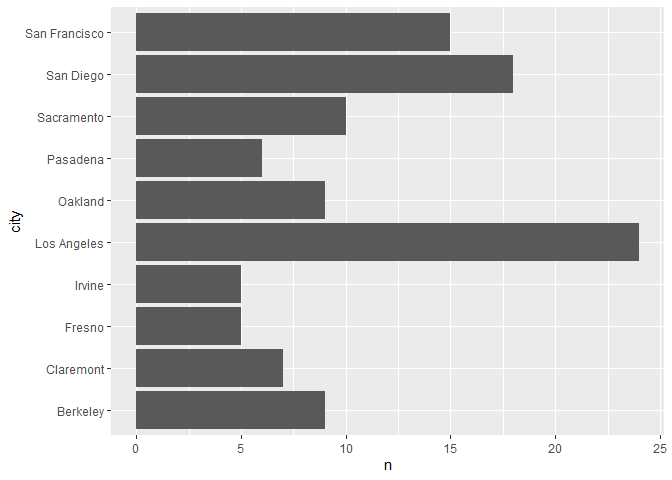

## Instructions
Answer the following questions and complete the exercises in RMarkdown. Please embed all of your code and push your final work to your repository. Your final lab report should be organized, clean, and run free from errors. Remember, you must remove the `#` for the included code chunks to run. Be sure to add your name to the author header above.  

Make sure to use the formatting conventions of RMarkdown to make your report neat and clean!  

## Load the libraries

```r
library(tidyverse)
library(janitor)
library(here)
library(naniar)
```

For this homework, we will take a departure from biological data and use data about California colleges. These data are a subset of the national college scorecard (https://collegescorecard.ed.gov/data/). Load the `ca_college_data.csv` as a new object called `colleges`.

```r
colleges <- readr::read_csv(here("lab9", "data", "ca_college_data.csv")) %>% clean_names %>% glimpse()
```

```
## Rows: 341 Columns: 10
```

```
## -- Column specification --------------------------------------------------------
## Delimiter: ","
## chr (4): INSTNM, CITY, STABBR, ZIP
## dbl (6): ADM_RATE, SAT_AVG, PCIP26, COSTT4_A, C150_4_POOLED, PFTFTUG1_EF
```

```
## 
## i Use `spec()` to retrieve the full column specification for this data.
## i Specify the column types or set `show_col_types = FALSE` to quiet this message.
```

```
## Rows: 341
## Columns: 10
## $ instnm        <chr> "Grossmont College", "College of the Sequoias", "College~
## $ city          <chr> "El Cajon", "Visalia", "San Mateo", "Ventura", "Oxnard",~
## $ stabbr        <chr> "CA", "CA", "CA", "CA", "CA", "CA", "CA", "CA", "CA", "C~
## $ zip           <chr> "92020-1799", "93277-2214", "94402-3784", "93003-3872", ~
## $ adm_rate      <dbl> NA, NA, NA, NA, NA, NA, NA, NA, NA, NA, NA, NA, NA, NA, ~
## $ sat_avg       <dbl> NA, NA, NA, NA, NA, NA, NA, NA, NA, NA, NA, NA, NA, NA, ~
## $ pcip26        <dbl> 0.0016, 0.0066, 0.0038, 0.0035, 0.0085, 0.0151, 0.0000, ~
## $ costt4_a      <dbl> 7956, 8109, 8278, 8407, 8516, 8577, 8580, 9181, 9281, 93~
## $ c150_4_pooled <dbl> NA, NA, NA, NA, NA, NA, 0.2334, NA, NA, NA, NA, 0.1704, ~
## $ pftftug1_ef   <dbl> 0.3546, 0.5413, 0.3567, 0.3824, 0.2753, 0.4286, 0.2307, ~
```

The variables are a bit hard to decipher, here is a key:  

INSTNM: Institution name  
CITY: California city  
STABBR: Location state  
ZIP: Zip code  
ADM_RATE: Admission rate  
SAT_AVG: SAT average score  
PCIP26: Percentage of degrees awarded in Biological And Biomedical Sciences  
COSTT4_A: Annual cost of attendance  
C150_4_POOLED: 4-year completion rate  
PFTFTUG1_EF: Percentage of undergraduate students who are first-time, full-time degree/certificate-seeking undergraduate students  

1. Use your preferred function(s) to have a look at the data and get an idea of its structure. Make sure you summarize NA's and determine whether or not the data are tidy. You may also consider dealing with any naming issues.

```r
skimr::skim(colleges)
```


Table: Data summary

|                         |         |
|:------------------------|:--------|
|Name                     |colleges |
|Number of rows           |341      |
|Number of columns        |10       |
|_______________________  |         |
|Column type frequency:   |         |
|character                |4        |
|numeric                  |6        |
|________________________ |         |
|Group variables          |None     |


**Variable type: character**

|skim_variable | n_missing| complete_rate| min| max| empty| n_unique| whitespace|
|:-------------|---------:|-------------:|---:|---:|-----:|--------:|----------:|
|instnm        |         0|             1|  10|  63|     0|      341|          0|
|city          |         0|             1|   4|  19|     0|      161|          0|
|stabbr        |         0|             1|   2|   2|     0|        3|          0|
|zip           |         0|             1|   5|  10|     0|      324|          0|


**Variable type: numeric**

|skim_variable | n_missing| complete_rate|     mean|       sd|      p0|      p25|      p50|      p75|     p100|hist                                     |
|:-------------|---------:|-------------:|--------:|--------:|-------:|--------:|--------:|--------:|--------:|:----------------------------------------|
|adm_rate      |       240|          0.30|     0.59|     0.23|    0.08|     0.46|     0.64|     0.75|     1.00|▂▃▆▇▃ |
|sat_avg       |       276|          0.19|  1112.31|   170.80|  870.00|   985.00|  1078.00|  1237.00|  1555.00|▇▇▅▂▂ |
|pcip26        |        35|          0.90|     0.02|     0.04|    0.00|     0.00|     0.00|     0.02|     0.22|▇▁▁▁▁ |
|costt4_a      |       124|          0.64| 26685.17| 18122.70| 7956.00| 12578.00| 16591.00| 39289.00| 69355.00|▇▂▂▁▂ |
|c150_4_pooled |       221|          0.35|     0.57|     0.21|    0.06|     0.43|     0.58|     0.72|     0.96|▂▃▇▇▅ |
|pftftug1_ef   |        53|          0.84|     0.56|     0.29|    0.01|     0.32|     0.50|     0.81|     1.00|▃▇▆▅▇ |


```r
miss_var_summary(colleges) #Missing SAT Averages as community colleges don't need them
```

```
## # A tibble: 10 x 3
##    variable      n_miss pct_miss
##    <chr>          <int>    <dbl>
##  1 sat_avg          276     80.9
##  2 adm_rate         240     70.4
##  3 c150_4_pooled    221     64.8
##  4 costt4_a         124     36.4
##  5 pftftug1_ef       53     15.5
##  6 pcip26            35     10.3
##  7 instnm             0      0  
##  8 city               0      0  
##  9 stabbr             0      0  
## 10 zip                0      0
```


```r
colleges #Data is tidy, as each variable has its own column, each observation itsrow,and each value its own cell.
```

```
## # A tibble: 341 x 10
##    instnm     city   stabbr zip   adm_rate sat_avg pcip26 costt4_a c150_4_pooled
##    <chr>      <chr>  <chr>  <chr>    <dbl>   <dbl>  <dbl>    <dbl>         <dbl>
##  1 Grossmont~ El Ca~ CA     9202~       NA      NA 0.0016     7956        NA    
##  2 College o~ Visal~ CA     9327~       NA      NA 0.0066     8109        NA    
##  3 College o~ San M~ CA     9440~       NA      NA 0.0038     8278        NA    
##  4 Ventura C~ Ventu~ CA     9300~       NA      NA 0.0035     8407        NA    
##  5 Oxnard Co~ Oxnard CA     9303~       NA      NA 0.0085     8516        NA    
##  6 Moorpark ~ Moorp~ CA     9302~       NA      NA 0.0151     8577        NA    
##  7 Skyline C~ San B~ CA     9406~       NA      NA 0          8580         0.233
##  8 Glendale ~ Glend~ CA     9120~       NA      NA 0.002      9181        NA    
##  9 Citrus Co~ Glend~ CA     9174~       NA      NA 0.0021     9281        NA    
## 10 Fresno Ci~ Fresno CA     93741       NA      NA 0.0324     9370        NA    
## # ... with 331 more rows, and 1 more variable: pftftug1_ef <dbl>
```

2. Which cities in California have the highest number of colleges?

**LA has the most colleges in California, followed by San Diego, San Francisco, then Sacramento.**

```r
top_cities_college <- colleges %>%
  count(city) %>%
  arrange(desc(n)) %>%
  head(n=10)
top_cities_college
```

```
## # A tibble: 10 x 2
##    city              n
##    <chr>         <int>
##  1 Los Angeles      24
##  2 San Diego        18
##  3 San Francisco    15
##  4 Sacramento       10
##  5 Berkeley          9
##  6 Oakland           9
##  7 Claremont         7
##  8 Pasadena          6
##  9 Fresno            5
## 10 Irvine            5
```

3. Based on your answer to #2, make a plot that shows the number of colleges in the top 10 cities.

```r
top_cities_college %>%
  ggplot(aes(x=city, y=n)) +geom_bar(stat="identity") + coord_flip()
```

<!-- -->

4. The column `COSTT4_A` is the annual cost of each institution. Which city has the highest average cost? Where is it located?

**Claremont has the highest average cost in California.**

```r
colleges %>%
  group_by(city) %>%
  summarize(average_coa=mean(costt4_a, na.rm=T)) %>%
  arrange(desc(average_coa))
```

```
## # A tibble: 161 x 2
##    city                average_coa
##    <chr>                     <dbl>
##  1 Claremont                 66498
##  2 Malibu                    66152
##  3 Valencia                  64686
##  4 Orange                    64501
##  5 Redlands                  61542
##  6 Moraga                    61095
##  7 Atherton                  56035
##  8 Thousand Oaks             54373
##  9 Rancho Palos Verdes       50758
## 10 La Verne                  50603
## # ... with 151 more rows
```

5. Based on your answer to #4, make a plot that compares the cost of the individual colleges in the most expensive city. Bonus! Add UC Davis here to see how it compares :>).

```r
colleges %>%
  filter(city=="Claremont" | city=="Davis") %>%
  ggplot(aes(x=instnm, y=costt4_a)) + geom_col() +coord_flip()
```

```
## Warning: Removed 2 rows containing missing values (position_stack).
```

<!-- -->

6. The column `ADM_RATE` is the admissions rate by college and `C150_4_POOLED` is the four-year completion rate. Use a scatterplot to show the relationship between these two variables. What do you think this means?

**From the scatter plot, we see a general decrease in 4 year graduation rates as admission rates increase. The plot suggests that as admission rate increases, the 4 year graduation rate decreases.**

```r
colleges %>%
  ggplot(aes(x=adm_rate, y=c150_4_pooled)) +geom_point() +geom_smooth(method=lm, se=T)
```

```
## `geom_smooth()` using formula 'y ~ x'
```

```
## Warning: Removed 251 rows containing non-finite values (stat_smooth).
```

```
## Warning: Removed 251 rows containing missing values (geom_point).
```

<!-- -->

7. Is there a relationship between cost and four-year completion rate? (You don't need to do the stats, just produce a plot). What do you think this means?

**We see a slight increasing slope between the two variables. As cost of attendance increases, the 4 year graduation rate slightly increases with it.**

```r
colleges %>%
  ggplot(aes(x=costt4_a, y=c150_4_pooled)) +geom_point() +geom_smooth(method=lm)
```

```
## `geom_smooth()` using formula 'y ~ x'
```

```
## Warning: Removed 225 rows containing non-finite values (stat_smooth).
```

```
## Warning: Removed 225 rows containing missing values (geom_point).
```

<!-- -->

8. The column titled `INSTNM` is the institution name. We are only interested in the University of California colleges. Make a new data frame that is restricted to UC institutions. You can remove `Hastings College of Law` and `UC San Francisco` as we are only interested in undergraduate institutions.

Remove `Hastings College of Law` and `UC San Francisco` and store the final data frame as a new object `univ_calif_final`.

```r
univ_cali <- colleges %>%
  filter(str_detect(instnm, "University of California") & str_detect(instnm, c("Hastings", "San Francisco"), negate=T))
```

```
## Warning in stri_detect_regex(string, pattern, negate = negate, opts_regex =
## opts(pattern)): longer object length is not a multiple of shorter object length
```

```r
univ_cali
```

```
## # A tibble: 8 x 10
##   instnm      city   stabbr zip   adm_rate sat_avg pcip26 costt4_a c150_4_pooled
##   <chr>       <chr>  <chr>  <chr>    <dbl>   <dbl>  <dbl>    <dbl>         <dbl>
## 1 University~ La Jo~ CA     92093    0.357    1324  0.216    31043         0.872
## 2 University~ Irvine CA     92697    0.406    1206  0.107    31198         0.876
## 3 University~ River~ CA     92521    0.663    1078  0.149    31494         0.73 
## 4 University~ Los A~ CA     9009~    0.180    1334  0.155    33078         0.911
## 5 University~ Davis  CA     9561~    0.423    1218  0.198    33904         0.850
## 6 University~ Santa~ CA     9506~    0.578    1201  0.193    34608         0.776
## 7 University~ Berke~ CA     94720    0.169    1422  0.105    34924         0.916
## 8 University~ Santa~ CA     93106    0.358    1281  0.108    34998         0.816
## # ... with 1 more variable: pftftug1_ef <dbl>
```

Use `separate()` to separate institution name into two new columns "UNIV" and "CAMPUS".

```r
univ_cali_f <- univ_cali %>%
  separate(instnm, into=c("univ", "campus"), sep = "-")
univ_cali_f
```

```
## # A tibble: 8 x 11
##   univ  campus city  stabbr zip   adm_rate sat_avg pcip26 costt4_a c150_4_pooled
##   <chr> <chr>  <chr> <chr>  <chr>    <dbl>   <dbl>  <dbl>    <dbl>         <dbl>
## 1 Univ~ San D~ La J~ CA     92093    0.357    1324  0.216    31043         0.872
## 2 Univ~ Irvine Irvi~ CA     92697    0.406    1206  0.107    31198         0.876
## 3 Univ~ River~ Rive~ CA     92521    0.663    1078  0.149    31494         0.73 
## 4 Univ~ Los A~ Los ~ CA     9009~    0.180    1334  0.155    33078         0.911
## 5 Univ~ Davis  Davis CA     9561~    0.423    1218  0.198    33904         0.850
## 6 Univ~ Santa~ Sant~ CA     9506~    0.578    1201  0.193    34608         0.776
## 7 Univ~ Berke~ Berk~ CA     94720    0.169    1422  0.105    34924         0.916
## 8 Univ~ Santa~ Sant~ CA     93106    0.358    1281  0.108    34998         0.816
## # ... with 1 more variable: pftftug1_ef <dbl>
```

9. The column `ADM_RATE` is the admissions rate by campus. Which UC has the lowest and highest admissions rates? Produce a numerical summary and an appropriate plot.

```r
univ_cali_f %>%
  filter(adm_rate==max(adm_rate)|adm_rate==min(adm_rate)) %>%
  select(univ,campus,adm_rate)
```

```
## # A tibble: 2 x 3
##   univ                     campus    adm_rate
##   <chr>                    <chr>        <dbl>
## 1 University of California Riverside    0.663
## 2 University of California Berkeley     0.169
```


```r
univ_cali_f %>%
  filter(adm_rate==max(adm_rate)|adm_rate==min(adm_rate)) %>%
  select(univ,campus,adm_rate) %>%
  ggplot(aes(x=campus, y=adm_rate)) +geom_col()
```

<!-- -->

10. If you wanted to get a degree in biological or biomedical sciences, which campus confers the majority of these degrees? Produce a numerical summary and an appropriate plot.

```r
univ_cali_f %>%
  filter(pcip26==max(pcip26)) 
```

```
## # A tibble: 1 x 11
##   univ  campus city  stabbr zip   adm_rate sat_avg pcip26 costt4_a c150_4_pooled
##   <chr> <chr>  <chr> <chr>  <chr>    <dbl>   <dbl>  <dbl>    <dbl>         <dbl>
## 1 Univ~ San D~ La J~ CA     92093    0.357    1324  0.216    31043         0.872
## # ... with 1 more variable: pftftug1_ef <dbl>
```


```r
univ_cali_f %>%
  ggplot(aes(x=campus, y=pcip26)) +geom_col()
```

<!-- -->

## Knit Your Output and Post to [GitHub](https://github.com/FRS417-DataScienceBiologists)
