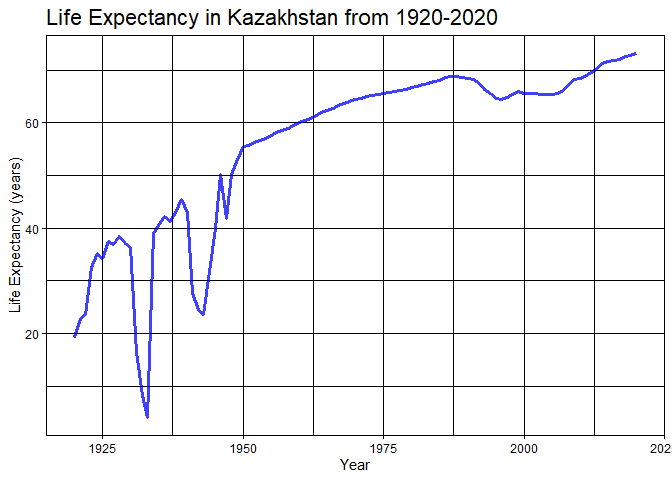
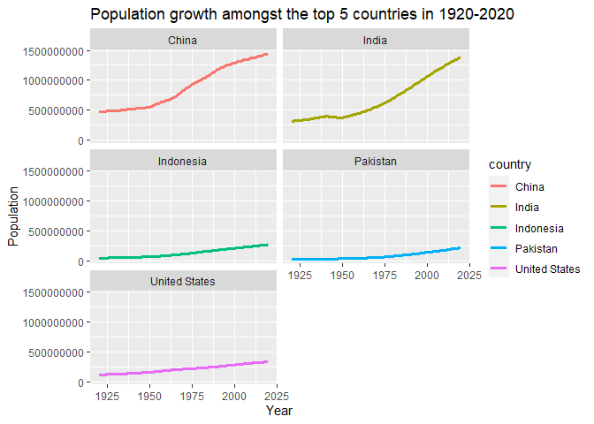
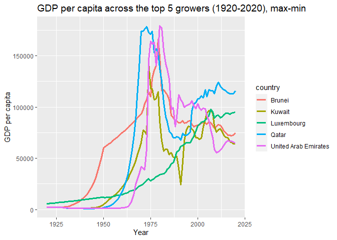
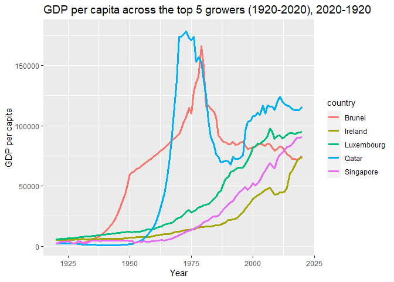
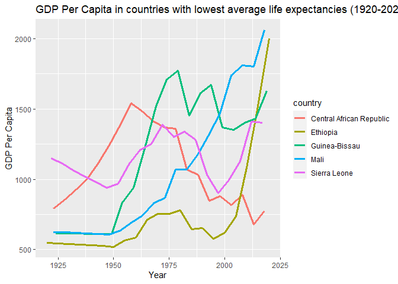

```r
options(scipen=999)
```

## Instructions
Answer the following questions and complete the exercises in RMarkdown. Please embed all of your code and push your final work to your repository. Your code should be organized, clean, and run free from errors. Be sure to **add your name** to the author header above. You may use any resources to answer these questions (including each other), but you may not post questions to Open Stacks or external help sites. There are 10 total questions.  

Make sure to use the formatting conventions of RMarkdown to make your report neat and clean! Your plots should use consistent aesthetics throughout.  

This exam is due by **12:00p on Tuesday, February 22**.  

## Gapminder
For this assignment, we are going to use data from  [gapminder](https://www.gapminder.org/). Gapminder includes information about economics, population, social issues, and life expectancy from countries all over the world. We will use three data sets, so please load all three as separate objects.    

1. population_total.csv  
2. income_per_person_gdppercapita_ppp_inflation_adjusted.csv  
3. life_expectancy_years.csv  

1. (3 points) Once you have an idea of the structure of the data, please make each data set tidy (hint: think back to pivots) and store them as new objects. You will need both the original (wide) and tidy (long) data!  


```r
pop <- readr::read_csv(here("midterm2","data", "population_total.csv"))
```

```
## Rows: 195 Columns: 302
```

```
## -- Column specification --------------------------------------------------------
## Delimiter: ","
## chr   (1): country
## dbl (301): 1800, 1801, 1802, 1803, 1804, 1805, 1806, 1807, 1808, 1809, 1810,...
```

```
## 
## i Use `spec()` to retrieve the full column specification for this data.
## i Specify the column types or set `show_col_types = FALSE` to quiet this message.
```

```r
anyNA(pop)
```

```
## [1] FALSE
```


```r
pop_tidy <- pop %>%
  pivot_longer(-country, names_to="year", values_to="population")
pop_tidy$year <- as.numeric(pop_tidy$year)
pop_tidy
```

```
## # A tibble: 58,695 x 3
##    country      year population
##    <chr>       <dbl>      <dbl>
##  1 Afghanistan  1800    3280000
##  2 Afghanistan  1801    3280000
##  3 Afghanistan  1802    3280000
##  4 Afghanistan  1803    3280000
##  5 Afghanistan  1804    3280000
##  6 Afghanistan  1805    3280000
##  7 Afghanistan  1806    3280000
##  8 Afghanistan  1807    3280000
##  9 Afghanistan  1808    3280000
## 10 Afghanistan  1809    3280000
## # ... with 58,685 more rows
```


```r
income <- readr::read_csv(here("midterm2", "data", "income_per_person_gdppercapita_ppp_inflation_adjusted.csv"))
```

```
## Rows: 193 Columns: 242
```

```
## -- Column specification --------------------------------------------------------
## Delimiter: ","
## chr   (1): country
## dbl (241): 1800, 1801, 1802, 1803, 1804, 1805, 1806, 1807, 1808, 1809, 1810,...
```

```
## 
## i Use `spec()` to retrieve the full column specification for this data.
## i Specify the column types or set `show_col_types = FALSE` to quiet this message.
```

```r
anyNA(income)
```

```
## [1] FALSE
```


```r
income_tidy <- income %>%
  pivot_longer(-country, names_to="year", values_to="income")
income_tidy$year <- as.numeric(income_tidy$year)
income_tidy
```

```
## # A tibble: 46,513 x 3
##    country      year income
##    <chr>       <dbl>  <dbl>
##  1 Afghanistan  1800    603
##  2 Afghanistan  1801    603
##  3 Afghanistan  1802    603
##  4 Afghanistan  1803    603
##  5 Afghanistan  1804    603
##  6 Afghanistan  1805    603
##  7 Afghanistan  1806    603
##  8 Afghanistan  1807    603
##  9 Afghanistan  1808    603
## 10 Afghanistan  1809    603
## # ... with 46,503 more rows
```


```r
life <- readr::read_csv(here("midterm2", "data", "life_expectancy_years.csv"))
```

```
## Rows: 187 Columns: 302
```

```
## -- Column specification --------------------------------------------------------
## Delimiter: ","
## chr   (1): country
## dbl (301): 1800, 1801, 1802, 1803, 1804, 1805, 1806, 1807, 1808, 1809, 1810,...
```

```
## 
## i Use `spec()` to retrieve the full column specification for this data.
## i Specify the column types or set `show_col_types = FALSE` to quiet this message.
```


```r
life_tidy <- life %>%
  pivot_longer(-country, names_to="year", values_to="life_expectancy")
life_tidy$year <- as.numeric(life_tidy$year)
life_tidy
```

```
## # A tibble: 56,287 x 3
##    country      year life_expectancy
##    <chr>       <dbl>           <dbl>
##  1 Afghanistan  1800            28.2
##  2 Afghanistan  1801            28.2
##  3 Afghanistan  1802            28.2
##  4 Afghanistan  1803            28.2
##  5 Afghanistan  1804            28.2
##  6 Afghanistan  1805            28.2
##  7 Afghanistan  1806            28.1
##  8 Afghanistan  1807            28.1
##  9 Afghanistan  1808            28.1
## 10 Afghanistan  1809            28.1
## # ... with 56,277 more rows
```

```r
miss_var_summary(life_tidy) # Note: there are NA's in the life expectancy data table
```

```
## # A tibble: 3 x 3
##   variable        n_miss pct_miss
##   <chr>            <int>    <dbl>
## 1 life_expectancy    759     1.35
## 2 country              0     0   
## 3 year                 0     0
```


```r
life_tidy %>%
  group_by(country) %>%
  miss_var_summary() %>%
  arrange(desc(n_miss)) #Andorra, Dominica, and the Marshall Islands have NA's
```

```
## # A tibble: 374 x 4
## # Groups:   country [187]
##    country          variable        n_miss pct_miss
##    <chr>            <chr>            <int>    <dbl>
##  1 Andorra          life_expectancy    253     84.1
##  2 Dominica         life_expectancy    253     84.1
##  3 Marshall Islands life_expectancy    253     84.1
##  4 Afghanistan      year                 0      0  
##  5 Afghanistan      life_expectancy      0      0  
##  6 Albania          year                 0      0  
##  7 Albania          life_expectancy      0      0  
##  8 Algeria          year                 0      0  
##  9 Algeria          life_expectancy      0      0  
## 10 Andorra          year                 0      0  
## # ... with 364 more rows
```

2. (1 point) How many different countries are represented in the data? Provide the total number and their names. Since each data set includes different numbers of countries, you will need to do this for each one.  

**In the population data set, there are** _195_ **distinct countries.**

```r
pop_tidy %>%
  distinct(country)
```

```
## # A tibble: 195 x 1
##    country            
##    <chr>              
##  1 Afghanistan        
##  2 Albania            
##  3 Algeria            
##  4 Andorra            
##  5 Angola             
##  6 Antigua and Barbuda
##  7 Argentina          
##  8 Armenia            
##  9 Australia          
## 10 Austria            
## # ... with 185 more rows
```


```r
pop_tidy %>%
  summarize(distinct_countries=n_distinct(country))
```

```
## # A tibble: 1 x 1
##   distinct_countries
##                <int>
## 1                195
```

**In the income (GDP per capita) data set, there are** _193_ **distinct countries.**

```r
income_tidy %>%
  distinct(country)
```

```
## # A tibble: 193 x 1
##    country            
##    <chr>              
##  1 Afghanistan        
##  2 Albania            
##  3 Algeria            
##  4 Andorra            
##  5 Angola             
##  6 Antigua and Barbuda
##  7 Argentina          
##  8 Armenia            
##  9 Australia          
## 10 Austria            
## # ... with 183 more rows
```


```r
income_tidy %>%
  summarize(distinct_countries=n_distinct(country))
```

```
## # A tibble: 1 x 1
##   distinct_countries
##                <int>
## 1                193
```

**In the life expectancy data set, there are** _187_ **distinct countries.**

```r
life_tidy %>%
  distinct(country)
```

```
## # A tibble: 187 x 1
##    country            
##    <chr>              
##  1 Afghanistan        
##  2 Albania            
##  3 Algeria            
##  4 Andorra            
##  5 Angola             
##  6 Antigua and Barbuda
##  7 Argentina          
##  8 Armenia            
##  9 Australia          
## 10 Austria            
## # ... with 177 more rows
```


```r
life_tidy %>%
  summarize(distinct_countries=n_distinct(country))
```

```
## # A tibble: 1 x 1
##   distinct_countries
##                <int>
## 1                187
```

## Life Expectancy  

3. (2 points) Let's limit the data to 100 years (1920-2020). For these years, which country has the highest average life expectancy? How about the lowest average life expectancy?  

**The country with the highest average life expectancy between 1920 and 2020 is Andorra with an average** _79.78_ **years. The country with the lowest is the Central Africa Republic with** _41.76_ **years. There are missing data entries for life expectancy with Andorra, resulting in less 100 years of life expectancies acccoutn for. The country with the second highest average life expectancy (through the full 100 years) is Sweden with** _73.52_**

```r
life_tidy %>%
  filter(year<=2020 & year>=1920) %>%
  group_by(country) %>%
  summarize(mean_life_expectancy=mean(life_expectancy, na.rm=T)) %>%
  arrange(desc(mean_life_expectancy)) %>%
  filter(mean_life_expectancy==max(mean_life_expectancy) | mean_life_expectancy==min(mean_life_expectancy) | country=="Sweden") # Note: Andorra has missing data in a range of years
```

```
## # A tibble: 3 x 2
##   country                  mean_life_expectancy
##   <chr>                                   <dbl>
## 1 Andorra                                  79.8
## 2 Sweden                                   73.5
## 3 Central African Republic                 41.8
```


```r
life_tidy %>%
  filter(year<=2020 & year>=1920) %>%
  group_by(country) %>%
  summarize(mean_life_expectancy=mean(life_expectancy, na.rm=T)) %>%
  arrange(desc(mean_life_expectancy)) %>%
  head(n=5)
```

```
## # A tibble: 5 x 2
##   country     mean_life_expectancy
##   <chr>                      <dbl>
## 1 Andorra                     79.8
## 2 Sweden                      73.5
## 3 Norway                      73.2
## 4 Netherlands                 73.0
## 5 Dominica                    73.0
```

4. (3 points) Although we can see which country has the highest life expectancy for the past 100 years, we don't know which countries have changed the most. What are the top 5 countries that have experienced the biggest improvement in life expectancy between 1920-2020?  

**The top 5 countries that have experienced the biggest improvement in life expectancy are:** _Kazakhstan, Lithuania, Poland, Ukraine and the Kyrgyz Republic (Kyrgyzstan)._

```r
life_tidy %>%
  filter(year<=2020 & year>=1920 & life_expectancy!=is.na(.)) %>%
  group_by(country) %>%
  summarize(life_expectancy_change=max(life_expectancy)-min(life_expectancy)) %>%
  arrange(desc(life_expectancy_change)) %>%
  head(n=5, life_expectancy_change)
```

```
## # A tibble: 5 x 2
##   country         life_expectancy_change
##   <chr>                            <dbl>
## 1 Kazakhstan                        69.0
## 2 Lithuania                         63.6
## 3 Poland                            63.1
## 4 Ukraine                           62.9
## 5 Kyrgyz Republic                   61.2
```

5. (3 points) Make a plot that shows the change over the past 100 years for the country with the biggest improvement in life expectancy. Be sure to add appropriate aesthetics to make the plot clean and clear. Once you have made the plot, do a little internet searching and see if you can discover what historical event may have contributed to this remarkable change.  

__One historical event that may have contributed to this remarkable change would be the intervention done by the Soviet Union around the 1930s-1960s.__

```r
life_tidy %>%
  filter(country=="Kazakhstan" & year<=2020 & year>=1920) %>%
  ggplot(aes(x=year, y=life_expectancy,)) +geom_line(color="blue", size=1.2, alpha=0.75) +theme_linedraw() +labs(x="Year", y="Life Expectancy (years)", title="Life Expectancy in Kazakhstan from 1920-2020") +theme(plot.title=element_text(size=rel(1.5), hjus=0)) +xlim(1920,2020)
```

<!-- -->

## Population Growth
6. (3 points) Which 5 countries have had the highest population growth over the past 100 years (1920-2020)?  

**The 5 countries with the highest population growth over the past 100 years are:** _India, China, Indonesia, the United States, and Pakistan._

```r
pop_tidy %>%
  filter(year<=2020 & year>=1920) %>%
  group_by(country) %>%
  summarize(population_growth = max(population)-min(population)) %>%
  arrange(desc(population_growth)) %>%
  head(n=10)
```

```
## # A tibble: 10 x 2
##    country       population_growth
##    <chr>                     <dbl>
##  1 India                1063000000
##  2 China                 968000000
##  3 Indonesia             226700000
##  4 United States         220000000
##  5 Pakistan              199300000
##  6 Brazil                185400000
##  7 Nigeria               182700000
##  8 Bangladesh            137700000
##  9 Mexico                114200000
## 10 Philippines           100600000
```

7. (4 points) Produce a plot that shows the 5 countries that have had the highest population growth over the past 100 years (1920-2020). Which countries appear to have had exponential growth?  

**From face value, China and India have slight hints at exponential growth.**

```r
pop_tidy %>%
  filter(year<=2020 & year>=1920) %>%
  filter(country=="India" | country=="China" | country=="Indonesia" | country=="United States" | country=="Pakistan") %>%
  ggplot(aes(x=year, y=population, color=country)) +geom_line(size=1.2) +facet_wrap(~country, ncol=2) +labs(title="Population growth amongst the top 5 countries in 1920-2020", y="Population", x="Year")
```

<!-- -->

## Income
The units used for income are gross domestic product per person adjusted for differences in purchasing power in international dollars.

8. (4 points) As in the previous questions, which countries have experienced the biggest growth in per person GDP. Show this as a table and then plot the changes for the top 5 countries. With a bit of research, you should be able to explain the dramatic downturns of the wealthiest economies that occurred during the 1980's.  


**From minimum to maximum values in income, the United Arab Emirates, Qatar, Brunei, Kuwait, and Luxembourg had the greatest increases in GDP per capita.**

```r
income_tidy %>% #Sorting from max and min income
  filter(year<=2020 & year>=1920) %>%
  group_by(country) %>%
  summarize(income_growth=max(income)-min(income)) %>%
  arrange(desc(income_growth)) %>%
  head(n=20)
```

```
## # A tibble: 20 x 2
##    country              income_growth
##    <chr>                        <dbl>
##  1 United Arab Emirates        177840
##  2 Qatar                       176920
##  3 Brunei                      163870
##  4 Kuwait                      141560
##  5 Luxembourg                   92170
##  6 Singapore                    88060
##  7 San Marino                   87520
##  8 Ireland                      68980
##  9 Saudi Arabia                 60210
## 10 Norway                       59520
## 11 Monaco                       55370
## 12 Andorra                      50810
## 13 Nauru                        50620
## 14 United States                50230
## 15 Palau                        49310
## 16 Netherlands                  46430
## 17 Switzerland                  46200
## 18 Iceland                      46090
## 19 Austria                      44310
## 20 Oman                         43930
```

**From 1920-2020 incomes, Qatar, Luxembourg, Singapore, Brunei, and Ireland had the greatest increase in GDP per capita.**

```r
income_tidy %>%
  pivot_wider(names_from = year, values_from=income, names_prefix = "year_") %>%
  select(country, year_1920, year_2020) %>%
  mutate(income_growth = year_2020-year_1920) %>%
  arrange(desc(income_growth))
```

```
## # A tibble: 193 x 4
##    country              year_1920 year_2020 income_growth
##    <chr>                    <dbl>     <dbl>         <dbl>
##  1 Qatar                     2300    116000        113700
##  2 Luxembourg                5730     95100         89370
##  3 Singapore                 2440     90500         88060
##  4 Brunei                    2130     75100         72970
##  5 Ireland                   5170     74100         68930
##  6 United Arab Emirates      2090     65300         63210
##  7 Kuwait                    2350     64300         61950
##  8 Norway                    8960     67500         58540
##  9 Monaco                    6630     62000         55370
## 10 San Marino                3280     57900         54620
## # ... with 183 more rows
```

__We see Qatar reach the top 5 in both lists. On another note, the Iranian Revolution and oil crisis in the 1980s attributed to the dramatic downturns of wealthy economies.__

*Table sorted by max-min income*

```r
income_tidy %>%
  filter(country=="United Arab Emirates" | country=="Qatar" | country=="Brunei" | country=="Kuwait" | country == "Luxembourg") %>%
  ggplot(aes(x=year, y=income, color=country)) +geom_line(size=1.2) +labs(x="Year", y="GDP per capita", title="GDP per capita across the top 5 growers (1920-2020), max-min") +theme(plot.title=element_text(size=rel(1.3))) +xlim(1920,2020)
```

```
## Warning: Removed 700 row(s) containing missing values (geom_path).
```

<!-- -->

*Table sorted by subtracting income from 2020 by income from 1920:*

```r
income_tidy %>%
  filter(country=="Singapore" | country=="Qatar" | country=="Brunei" | country=="Ireland" | country == "Luxembourg") %>%
  ggplot(aes(x=year, y=income, color=country)) +geom_line(size=1.2) +labs(x="Year", y="GDP per capita", title="GDP per capita across the top 5 growers (1920-2020), 2020-1920") +theme(plot.title=element_text(size=rel(1.3))) +xlim(1920,2020)
```

```
## Warning: Removed 700 row(s) containing missing values (geom_path).
```

<!-- -->

9. (3 points) Create three new objects that restrict each data set (life expectancy, population, income) to the years 1920-2020. Hint: I suggest doing this with the long form of your data. Once this is done, merge all three data sets using the code I provide below. You may need to adjust the code depending on how you have named your objects. I called mine `life_expectancy_100`, `population_100`, and `income_100`. For some of you, learning these `joins` will be important for your project.  


```r
life_expectancy_100 <- life_tidy %>%
  filter(year<=2020 & year>=1920) 
life_expectancy_100
```

```
## # A tibble: 18,887 x 3
##    country      year life_expectancy
##    <chr>       <dbl>           <dbl>
##  1 Afghanistan  1920            30.6
##  2 Afghanistan  1921            30.7
##  3 Afghanistan  1922            30.8
##  4 Afghanistan  1923            30.8
##  5 Afghanistan  1924            30.9
##  6 Afghanistan  1925            31  
##  7 Afghanistan  1926            31  
##  8 Afghanistan  1927            31.1
##  9 Afghanistan  1928            31.1
## 10 Afghanistan  1929            31.2
## # ... with 18,877 more rows
```


```r
population_100 <- pop_tidy %>%
  filter(year<=2020 & year>=1920) 
population_100
```

```
## # A tibble: 19,695 x 3
##    country      year population
##    <chr>       <dbl>      <dbl>
##  1 Afghanistan  1920   10600000
##  2 Afghanistan  1921   10500000
##  3 Afghanistan  1922   10300000
##  4 Afghanistan  1923    9710000
##  5 Afghanistan  1924    9200000
##  6 Afghanistan  1925    8720000
##  7 Afghanistan  1926    8260000
##  8 Afghanistan  1927    7830000
##  9 Afghanistan  1928    7420000
## 10 Afghanistan  1929    7100000
## # ... with 19,685 more rows
```


```r
income_100 <- income_tidy %>%
  filter(year<=2020 & year>=1920)
income_100
```

```
## # A tibble: 19,493 x 3
##    country      year income
##    <chr>       <dbl>  <dbl>
##  1 Afghanistan  1920   1490
##  2 Afghanistan  1921   1520
##  3 Afghanistan  1922   1550
##  4 Afghanistan  1923   1570
##  5 Afghanistan  1924   1600
##  6 Afghanistan  1925   1630
##  7 Afghanistan  1926   1650
##  8 Afghanistan  1927   1680
##  9 Afghanistan  1928   1710
## 10 Afghanistan  1929   1740
## # ... with 19,483 more rows
```


```r
gapminder_join <- inner_join(life_expectancy_100, population_100, by= c("country", "year"))
gapminder_join <- inner_join(gapminder_join, income_100, by= c("country", "year"))
gapminder_join
```

```
## # A tibble: 18,887 x 5
##    country      year life_expectancy population income
##    <chr>       <dbl>           <dbl>      <dbl>  <dbl>
##  1 Afghanistan  1920            30.6   10600000   1490
##  2 Afghanistan  1921            30.7   10500000   1520
##  3 Afghanistan  1922            30.8   10300000   1550
##  4 Afghanistan  1923            30.8    9710000   1570
##  5 Afghanistan  1924            30.9    9200000   1600
##  6 Afghanistan  1925            31      8720000   1630
##  7 Afghanistan  1926            31      8260000   1650
##  8 Afghanistan  1927            31.1    7830000   1680
##  9 Afghanistan  1928            31.1    7420000   1710
## 10 Afghanistan  1929            31.2    7100000   1740
## # ... with 18,877 more rows
```

10. (4 points) Use the joined data to perform an analysis of your choice. The analysis should include a comparison between two or more of the variables `life_expectancy`, `population`, or `income.`  

**Analyzing GDP per capita for countries with lowest average life expectancy**

```r
gapminder_join %>%
  group_by(country) %>%
  summarize(mean_life = mean(life_expectancy, na.rm=T)) %>%
  arrange(mean_life) %>%
  head(n=5)
```

```
## # A tibble: 5 x 2
##   country                  mean_life
##   <chr>                        <dbl>
## 1 Central African Republic      41.8
## 2 Mali                          41.8
## 3 Ethiopia                      42.6
## 4 Sierra Leone                  42.6
## 5 Guinea-Bissau                 42.6
```

```r
gapminder_join %>%
  filter(country==c("Central African Republic", "Mali", "Ethiopia", "Sierra Leone", "Guinea-Bissau")) %>%
  ggplot(aes(x=year, y=income, color=country)) +geom_line(size=1.2) +labs(x="Year", y="GDP Per Capita", title="GDP Per Capita in countries with lowest average life expectancies (1920-2020)") +theme(plot.title=element_text(size=rel(1.2)))
```

```
## Warning in country == c("Central African Republic", "Mali", "Ethiopia", : longer
## object length is not a multiple of shorter object length
```

<!-- -->


